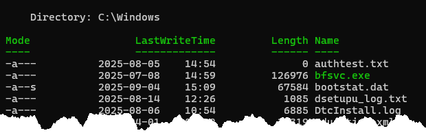
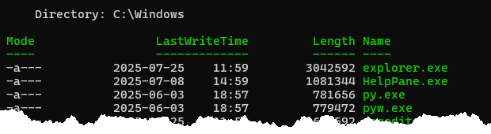
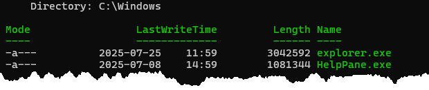
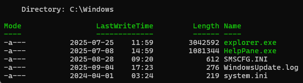
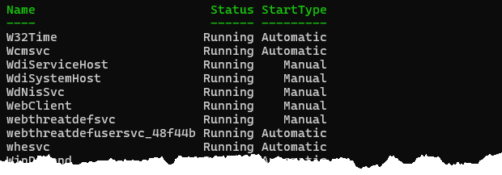
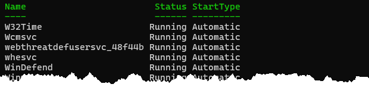
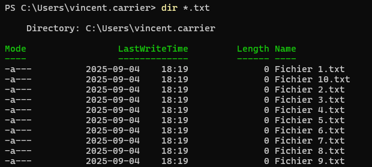
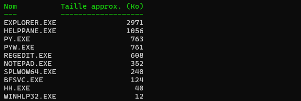
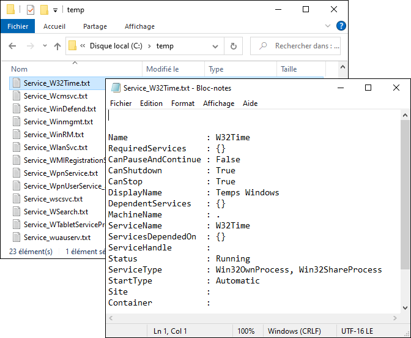

Les exercices suivants visent à vous familiariser avec les commandes PowerShell, les alias et les objets retournés par les commandes.

Vous pouvez télécharger ces exercices sous forme de fichier PowerShell. Ouvrez le fichier dans Visual Studio Code (avec l'extension PowerShell installée). Vous pouvez sélectionner une ligne de commande et appuyer sur la touche F8 pour exécuter cette commande dans le terminal intégré.

📝 [Exercice R04](https://github.com/vcarrier/3t5-exercices/tree/main/R04%20-%20Tableaux)

## Exercice 1: Les fichiers

#### 4.1.1. Obtenir tous les fichiers contenus dans le répertoire C:\Windows.
   

#### 4.1.2. Obtenir tous les fichiers contenus dans le répertoire C:\Windows, triés par ordre décroissant de taille.

#### 4.1.3. Même chose, mais montrer seulement les fichiers plus grands que 1 mégaoctet.

#### 4.1.4. Même chose, mais montrer seulement les fichiers qui pèsent entre 1 et 10 mégaoctets.

#### 4.1.5. Même chose, mais montrer seulement les fichiers qui pèsent soit plus de 1 mégaoctet ou moins de 1 kilooctet.

## Exercice 2: Les services

#### 4.2.1. Obtenir la liste de tous les services dont le nom commence par W et afficher les propriétés Name, Status et StartType dans un tableau.

#### 4.2.2. Même chose, mais montrer seulement les services en cours d'exécution.

#### 4.2.3. Même chose, mais montrer seulement les services en cours d'exécution qui s'exécutent automatiquement.

## Exercice 3: Défis

#### 4.3.1. 🏆 Créer 10 fichiers nommés "Fichier 1.txt" à "Fichier 10.txt" dans le répertoire du profil de l'utilisateur.

:::tip Indice
Vous devrez créer un tableau et utiliser la commande `ForEach-Object`!
:::

#### 4.3.2. 🏆 Dressez la liste de tous les fichiers .EXE dans C:\Windows, sous forme d'un tableau montrant le nom du fichier en majuscules ainsi que la taille approximative en kilooctets, arrondi à l'entier près.

:::tip Indice
Utilisez les propriétés personnalisées avec `Select-Object`.
:::

#### 4.3.3. 🏆🏆 À partir de votre ligne de commande à la question 4.2.3, créez un fichier nommé "Service_nomduservice.txt" pour chaque service dans le répertoire courant. Chaque fichier doit contenir la liste détaillée de toutes les propriétés de ce service.

:::tip Indice
Vous aurez besoin de la commande `ForEach-Object` pour traiter individuellement chaque service, et de la commande `Out-File` ou `Set-Content` pour écrire le fichier. Vous aurez aussi probablement besoin d'insérer une structure `$()` dans une chaîne de caractères quelque part.
:::

