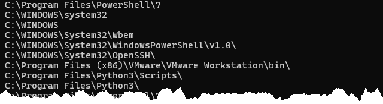

Les exercices suivants visent à vous familiariser avec les chaînes de caractères et les expressions régulières (regex).

Vous pouvez télécharger ces exercices sous forme de fichier PowerShell. Ouvrez le fichier dans Visual Studio Code (avec l'extension PowerShell installée). Vous pouvez sélectionner une ligne de commande et appuyer sur la touche F8 pour exécuter cette commande dans le terminal intégré.

📝 [Exercice R05](https://github.com/vcarrier/3t5-exercices/tree/main/R05%20-%20Strings%20et%20regex)


#### 5.1.1

Obtenir la liste de tous les chemins contenus dans la variable d'environnement `PATH`, sous forme de **tableau de strings**.




#### 5.1.2

Inverser le sens des barres obliques dans la chaîne `C:\Windows\System32` pour qu'elle devienne `C:/Windows/System32` en utilisant une méthode de remplacement (`replace`).


#### 5.1.3

En utilisant les solutions précédentes, inversez le sens des barres obliques pour tous les chemins de la variable `PATH`.


#### 5.1.4

En utilisant PowerShell, créer la variable suivante:

```powershell
$montexte = "Lorem ipsum dolor sit amet, consectetur adipiscing elit. "      + `
    "Donec interdum ut lorem eget consequat. Nam sed leo hendrerit diam "    + `
    "pharetra blandit. Vestibulum enim diam, congue sit amet sem in, "       + `
    "maximus varius metus. Pellentesque in turpis rutrum, ornare ante a, "   + `
    "dapibus felis. Sed pellentesque, nunc non tincidunt pretium, velit "    + `
    "lorem scelerisque sem, quis tristique elit ex vel massa. Nam quam "     + `
    "magna, tempus sit amet lacus in, placerat suscipit velit. Aenean "      + `
    "eleifend fermentum risus, at laoreet urna malesuada nec. Etiam "        + `
    "tempus lectus scelerisque, sagittis elit sed, posuere nunc. Ut id "     + `
    "dictum libero, sed pharetra metus. Phasellus ac elit arcu. Fusce "      + `
    "nec luctus neque. In commodo id tellus at placerat. Class aptent "      + `
    "taciti sociosqu ad litora torquent per conubia nostra, per "            + `
    "inceptos himenaeos. Nam turpis tortor, eleifend ut tristique "          + `
    "vel, eleifend ut neque."
```

Trouver la ligne de commande qui donne le **nombre de mots** dans ce texte.


#### 5.1.5

En utilisant le texte précédente, trouver la ligne de commande qui donne le **nombre de phrases**.


#### 5.1.6

En utilisant **une expression régulière**, valider si la chaîne de caractères "A1B 2C3" correspond à **un code postal canadien** à l'aide de l'opérateur `-Match`.

*Note: Un code postal canadien est constitué ainsi: lettre, chiffre, lettre, espace, chiffre, lettre, chiffre.*


#### 5.1.7

En utilisant **une expression régulière**, trouvez une ligne de commande qui retourne tous les chemins de la variable `PATH` qui **se terminent par un "\\"**.


