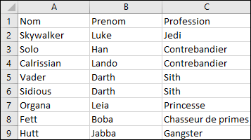
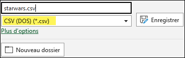
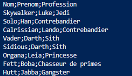
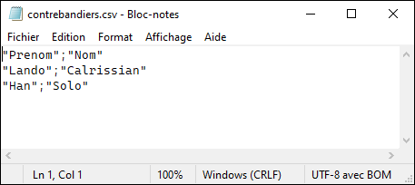

## Préparation

Dans le logiciel Excel, produisez un fichier CSV avec ces valeurs.

| Nom        | Prenom | Profession         |
| ---------- | ------ | ------------------ |
| Skywalker  | Luke   | Jedi               |
| Solo       | Han    | Contrebandier      |
| Calrissian | Lando  | Contrebandier      |
| Vader      | Darth  | Sith               |
| Sidious    | Darth  | Sith               |
| Organa     | Leia   | Princesse          |
| Fett       | Boba   | Chasseur de primes |
| Hutt       | Jabba  | Gangster           |

Voici ce que ça donne dans Excel.

Exportez ensuite le fichier en format CSV.

## Questions

### Ex. 5.1

Dans PowerShell, utilisez la commande Get-Content pour voir le contenu de ce fichier texte. Vous devriez voir ceci:

### Ex. 5.2

Utilisez maintenant la commande Import-Csv pour importer le fichier sous forme d'un tableau d'objets. Vous devriez avoir une structure semblable à celle-ci:

** Attention au délimiteur! **

### Ex. 5.3

Donnez le prénom et le nom des contrebandiers, en ordre alphabétique de nom.

### Ex. 5.4. 

Sauvegardez ces nouvelles données dans le fichier contrebandiers.csv afin qu'il puisse être ouvert dans Excel (donc encore attention au délimiteur. Attention aussi à la première ligne qui contient l'information de type. Le fichier devrait ressembler à ceci:

Le fichier devrait pouvoir être ouvert dans Excel sans erreur.

