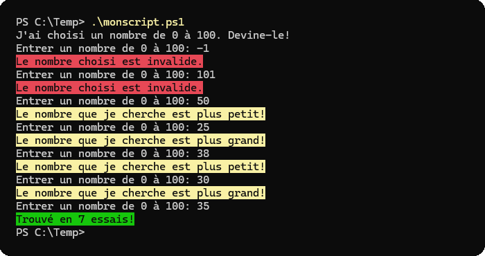

## Exercice 1: Exécution de script

Dans un répertoire de votre choix (je vous suggère un répertoire court comme C:­\Temp ou C:\EspaceLabo), créez un fichier .PS1. Mettez-lui du code quelconque, par exemple:

```powershell  showLineNumbers
$a = 3 + 4
$b = $a * 2
Write-Host "Le nombre est $b."
```

Tentez de lancer le script de plusieurs manières, en vous référant aux notes de cours:

- Dans Visual Studio Code
- Dans une console PowerShell
- Dans une console Windows PowerShell
- À partir d'une invite classique (CMD)

Faites de même dans votre VM **Windows 11**. Si vous avez des erreurs, n'oubliez pas d'ajuster la stratégie d'exécution!


## Exercice 2: Traces

On veut accomplir deux éléments principaux:
1. Indiquer quelles lignes de code s'exécutent dans quel ordre
2. Indiquer les effets de chaque ligne de code (valeur des variables)

### Exemple

<Row>

<Column>

Si on a le code suivant :
```powershell  showLineNumbers
$a = 3 + 4
$b = $a * 2
Write-Host "Le nombre est $b."
```

</Column>
<Column>
On aura la trace suivante :

| ligne exécutée | effet                             |
|-----------------|-----------------------------------|
| $a = 3 + 4       | $a: 7                             |
| $b = $a * 2      | $a: 7, $b: 14                     |
| Write-Host "Le nombre est $b." | $a: 7, $b: 14<br/>affiche "Le nombre est 14" |

</Column>
</Row>

### Première trace!

Faites la trace pour le script suivant:

```powershell showLineNumbers
$coll = 1..3
foreach ($item in $coll) {
    if ($item -gt 2) {
        Write-Host "$item est plus grand que 2"
    }
    elseif ($item -lt 2) {
        Write-Host "$item est petit que 2"
    }
    else {
        Write-Host "$item est égal à 2"
    }
}
```

Sur une feuille de papier ou dans un bloc-notes, remplissez un tableau comme pour l'exemple précédent. Vous devez indiquer chaque ligne de l'exécution.


### Validation de la trace

Une fois que votre tableau est rempli, validez la trace à l'aide du débogueur dans VS Code. Créez un fichier PS1 et copiez le code, puis insérer un point d'arrêt à la première ligne. Appuyez sur F5 pour déclencher le débogueur et faites un pas à pas détaillé. Notez l'état de chaque variable dans le panneau de gauche ou en survolant les variables avec votre curseur de souris. Si vous n'êtes pas à l'aise avec le débogueur, n'hésitez pas à interpeller votre professeur.


## Exercice 3: Algorithmes

Écrivez les scripts suivants.


**A)** Écrivez un script qui demande un nombre à l'utilisateur, et dit si ce nombre est pair ou impair. La commande à utiliser pour poser une question à l'utilisateur est `Read-Host`.


```
PS C:\Temp> .\monscript.ps1
Entrez un nombre: 3
Le nombre est impair!

PS C:\Temp> .\monscript.ps1
Entrez un nombre: 2
Le nombre est pair!
```


**B)** Modifiez le script précédent pour demander à l'utilisateur s'il veut poursuivre, et recommencer en boucle jusqu'à ce que l'utilisateur décide de quitter.


```
PS C:\Temp> .\monscript.ps1
Entrez un nombre: 3
Le nombre est impair!

Entrez un nombre: 2
Le nombre est pair!

Entrez un nombre:
Ok bye!!
```


**C)** Écrivez un script qui dessine cette forme à l'écran, de la dimension fournie par l'utilisateur. Vous devez utiliser une boucle.

```
PS C:\Temp> .\monscript.ps1
Entrez un nombre: 4
*
**
***
****

PS C:\Temp> .\monscript.ps1
Entrez un nombre: 5
*
**
***
****
*****
```


**D)** Écrivez ce petit jeu de devinette. Le script choisit un nombre secret de 0 à 100, et demande à l'utilisateur de deviner ce nombre.

Utilisez la commande Get-Random avec les paramètres `-Minimum` et `-Maximum` pour générer le nombre.



