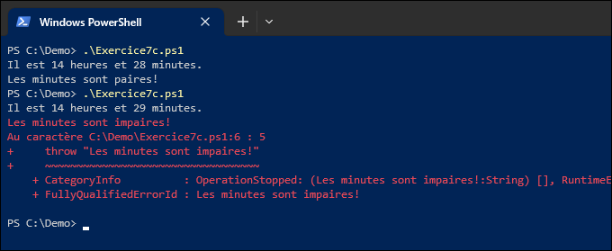

## 1. Gestion des erreurs

**a)** Écrivez un script qui prend en paramètre un ou plusieurs noms d'utilisateurs locaux et affiche les informations de chaque utilisateur qui existe.
        
- Utilisez la commande `Get-LocalUser` pour obtenir l'information sur les utilisateurs locaux.
- Les utilisateurs qui n'existent pas ne sont simplement pas dans la liste.
- Aucune erreur ne doit être affichée à la console.
- Vous pouvez spécifier l'action ***SilentlyContinue***.

```
PS C:\EspaceLabo> .\MonScript.ps1 -Name "Administrateur", "PereNoel", "Invité"

Name           Enabled Description
----           ------- -----------
Administrateur True    Compte d'utilisateur d'administration
Invité         False   Compte d'utilisateur invité
```

---

**b)** Écrivez un script qui prend en paramètre un ou plusieurs noms d'utilisateurs locaux (comme la question précédente) et affiche si chaque utilisateur existe ou non.

- Utilisez la commande `Get-LocalUser` pour obtenir l'information sur les utilisateurs
- L'affichage se fait avec `Write-Host`.
- Vous devez utiliser une structure `Try/Catch.`
- N'oubliez pas la commande `Out-Null` pour se débarrasser d'un objet

```
PS C:\EspaceLabo> .\MonScript.ps1 -Name "Administrateur", "PereNoel", "Invité"
L'utilisateur "Administrateur" existe.
L'utilisateur "PereNoel" n'existe pas.
L'utilisateur "Invité" existe.
```

---

**c)** Écrivez un script qui retourne une erreur lorsque les minutes sont impaires. Vous devriez utiliser l'instruction `throw`.



---

**d)** Écrivez un autre script qui **appelle le script précédent** et qui intercepte cette erreur en écrivant du texte personnalisé.

```
PS C:\Demo> .\Script2.ps1
Il est 14 heures et 30 minutes.
Les minutes sont paires!

PS C:\Demo> .\Script2.ps1
Il est 14 heures et 31 minutes.
# error-next-line
Erreur attrapée!
```

---

## 2. Journalisation

:::info
En faisant cet exercice, vous prenez de l'avance sur votre TP2, puisque vous pourrez réutiliser cette fonction!
:::

**a)** Écrivez une fonction `Write-Log` qui prend en paramètre **un message obligatoire non nul** pouvant également entrer par le **pipeline**. Cette fonction doit écrire le message dans un fichier **MonJournal.log** sauvegardé dans un sous-répertoire MonJournal contenu **dans le répertoire temporaire de l'utilisateur** (la fonction doit le créer s'il n'existe pas). Le message doit être préfixé de la date et l'heure dans le format montré dans l'exemple (c'est un timestamp).

Faites un script dans lequel votre fonction est définie au début. Appelez la fonction à quelques endroits dans le script après la fonction pour tester.

```powershell showLineNumbers
function Write-Log {
    # Écrivez votre belle fonction ici...
}

Write-Log -Message "Un premier message"

Write-Log -Message "Un deuxième message"

"Un message passé par le pipeline" | Write-Log
```

Le fichier devrait ressembler à ceci (notez le format du *timestamp*).

```
2025-09-30 08:11:46.180       Un premier message
2025-09-30 08:11:46.185       Un deuxième message
2025-09-30 08:11:46.208       Un message passé par le pipeline
```

Le fichier devrait se trouver dans le profil utilisateur, dans le répertoire suivant:

```
C:\Users\NomDeLutilisateur\AppData\Local\Temp\MonJournal\
```

:::tip Quelques conseils
- Le répertoire temporaire de l'utilisateur est défini dans la variable d'environnement `TEMP`.
- Utilisez la fonction `Get-Date` pour générer le timestamp.
:::

---

**b)** Ajoutez un paramètre à votre fonction pour spécifier un niveau de journalisation (*Info*, *Warning*, *Error*). Le niveau *Info* est celui par défaut lorsqu'aucun niveau n'est spécifié.

Par exemple, si votre fonction est appelée par ce script:

```powershell showLineNumbers
function Write-Log {
    # Écrivez votre belle fonction ici...
}

$ServiceName = "Abracadabra"

try {
    Write-Log -Message "Vérification du service $ServiceName"
    $Service = Get-Service -Name $ServiceName -ErrorAction Stop
    Write-Log -Message "L'état du service est: $($Service.Status)"
}
catch {
    Write-Log -Message "Impossible d'accéder au service $ServiceName!" -Level "Error"
}
```

Le fichier log devrait ressembler à ceci:

```
2025-09-30 08:17:01.552       Info     Vérification du service Abracadabra
2025-09-30 08:17:01.578       Error    Impossible d'accéder au service Abracadabra!
```

:::tip Quelques conseils
- Le paramètre `-Level` est un bon cas d'utilisation pour un critère de validation `[ValidateSet()]`.
- Pour que les messages soient parfaitement alignés malgré la différence dans le nombre de caractères du niveau de journalisation, la méthode `.PadRight()` peut vous être utile.
:::


---

**c)** 🏆 **Défi+++ (attention, difficile!)**

Pour un défi supplémentaire, implémentez un mécanisme de rotation automatique. Si le log dépasse une certaine taille (par exemple, un kilooctet), renommez le fichier `MonJournal.lo_` (si ce fichier existe déjà, il faut le remplacer) puis recommencez à écrire les entrées journal dans le nouveau fichier.
