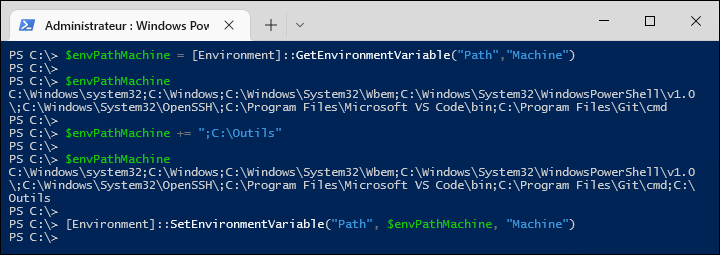
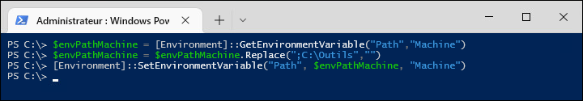

## Préparation

Dans votre environnement virtuel, assurez-vous d'avoir quelques machines. Vous devriez avoir au moins **un poste de travail (PC0001)** et **un serveur membre (SRV01)**. Créez-les à partir des modèles et **joignez-les au domaine**.


## Partie 1

Dans votre environnement de machines virtuelles, assurez-vous que WinRM est correctement configuré. 

À partir de votre machine de développement, testez une connexion avec `Enter-PSSession` sur chacune des machines (PC0001, SRV01...).  Quittez la session avec `Exit-PSSession`. 


## Partie 2

À partir de votre VM de développement, loggez-vous avec le compte Administrateur du domaine, puis procurez-vous l'outil WmiExplorer.exe et mettez-le dans un répertoire. 

Écrivez un script dans le même répertoire, qui prend en paramètre un nom de machine (donc de type [string]) et qui effectue la configuration suivante sur la machine cible:

- Créer un répertoire `C:\Outils`
- Copier dans `C:\Outils` le fichier WmiExplorer.exe (utilisez `Copy-Item`)
- Ajouter `C:\Outils` dans la variable d'environnement Path de la machine (voir l'explication à la fin de cette page)

Après chaque étape, décrivez l'opération dans la console avec `Write-Host`.

Pour réaliser ce script, vous devrez créer une session PSSession vers la machine cible, puis envoyer des commandes avec `Invoke-Command` vers cette session. À la fin du script, fermez la session. N'utilisez pas `Enter-PSSession` ni le paramètre ComputerName de `Invoke-Command`, créez plutôt une session avec `New-PSSession` et affectez-la à une variable.

Pour tester, loggez-vous sur la machine, démarrez une console de commande et tapez simplement `wmiexplorer.exe`. L'outil devrait démarrer sans avoir à spécifier le répertoire.

L'exécution du script devrait donner ceci dans la console:

```
PS C:\Scripts> .\Exercice.ps1 -Ordinateur "PC0001"
Session démarrée.
Répertoire créé.
Outil WmiExplorer copié.
Session fermée.
```

Voici la base du script:

```powershell
    param(
        [Parameter(Mandatory)] [String] $Ordinateur
    )
    
    # Démarrer une session PowerShell vers l'ordinateur distant
    
    # TODO votre code ici...
    
    Write-Host "Session démarrée."
    
    # ---
    # Créer le répertoire C:\Outils\ sur l'ordinateur distant
    
    # TODO votre code ici...
    
    Write-Host "Répertoire créé."
    
    # ---
    # Copier l'outil WmiExplorer dans C:\Outils\ sur l'ordinateur distant
    
    # TODO votre code ici...
    
    Write-Host "Outil WmiExplorer copié."
    
    # ---
    # Fermer la session
    
    # TODO votre code ici...
    
    Write-Host "Session fermée."
```

## Partie 3

Si vous avez le temps, essayez de bonifier votre script afin de lui donner ces fonctionnalités supplémentaires:


### Prise en charge de plusieurs machines

Faites en sorte qu'on puisse spécifier plusieurs noms de machine dans le paramètre. Créez toutes les sessions au début, puis effectuez les changements sur chacune des sessions distantes. Finalement, fermez toutes les sessions.

```
PS C:\Scripts> .\Exercice.ps1 -Ordinateurs "PC0001", "SRV01"
Sessions démarrées.
Répertoire créé sur PC0001.
Outil WmiExplorer copié sur PC0001.
Répertoire créé sur SRV01.
Outil WmiExplorer copié sur SRV01.
Session fermée.
```

### Spécifier le chemin du répertoire en paramètre

Faites en sorte qu'au lieu de `C:\Outils`, on puisse spécifier le chemin du répertoire à créer dans les paramètres.

```
PS C:\Scripts> .\Exercice.ps1 -Ordinateurs "PC0001", "SRV01" -Path "C:\Tools"
Sessions démarrées.
Répertoire C:\Tools créé sur PC0001.
Outil WmiExplorer copié dans C:\Tools sur PC0001.
Répertoire C:\Tools créé sur SRV01.
Outil WmiExplorer copié dans C:\Tools sur SRV01.
Session fermée.
```

### Contrôle de la variable d'environnement Path

Ajoutez le répertoire à la variable d'environnement PATH de la machine sur les ordinateurs distants si elle n'y figure pas déjà. 

```
PS C:\Scripts> .\Exercice.ps1 -Ordinateurs "PC0001", "SRV01" -Path "C:\Minou"
Sessions démarrées.
Répertoire C:\Minou créé sur PC0001.
Outil WmiExplorer copié dans C:\Minou sur PC0001.
Ajout de C:\Minou dans la variable d'environnement PATH de PC0001.
Répertoire C:\Minou créé sur SRV01.
Outil WmiExplorer copié dans C:\Minou sur SRV01.
Ajout de C:\Minou dans la variable d'environnement PATH de SRV01.
Session fermée.
```

Pour ajouter `C:\Outils` dans la variable, voici un exemple de comment procéder dans la console. Il sera effectif seulement pour les prochains processus à être démarrés; testez en démarrant une nouvelle console PowerShell et faites `$env:Path.Split(';')`.



Le code à exécuter est:

```powershell
    $EnvPathMachine = [Environment]::GetEnvironmentVariable("Path","Machine")
    $EnvPathMachine += ";C:\Outils"
    [Environment]::SetEnvironmentVariable("Path", $envPathMachine, "Machine")
```

:::tip
Pour retirer `C:\Outils` de la variable d'environnement, il suffit de faire ceci:



*Note: il y a deux variables d'environnement Path: celle de l'utilisateur et celle de la machine. La variable effective est la combinaison des deux, dans cet ordre. Dans cet exercice, c'est celle de la machine qu'on modifie, donc l'effet se fera sentir pour tous les utilisateurs du système.*
:::
