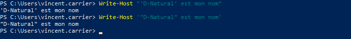
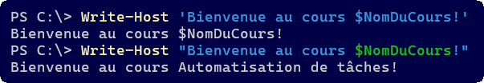

## Chaînes de caractères

Les chaînes de caractères sont un type de données particulièrement commun dans tous les langages de programmation, et PowerShell ne fait pas exception.

### Guillemets

En PowerShell, les chaînes de caractères sont balisées par des guillemets. Les guillemets simples et doubles sont acceptés.

<ConsoleWindow backgroundColor="#000046" >
```text
PS C:\> ("Guillemets doubles").GetType().Name
String

PS C:\> ('Guillemets simples').GetType().Name
String
```
</ConsoleWindow>

Un type de guillemet compris dans une chaîne balisée par l'autre type de guillemets sera affiché tel quel.


<ConsoleWindow backgroundColor="#000046" >
```text
PS C:\> Write-Host "Bienvenue au cours 'Automatisation de tâches'"
Bienvenue au cours 'Automatisation de tâches'

PS C:\> Write-Host 'Bienvenue au cours "Automatisation de tâches"'
Bienvenue au cours "Automatisation de tâches"
```
</ConsoleWindow>


Par contre, les deux types de guillemets se comportent différemment avec les variables. Le variables écrites dans une chaîne à guillemets doubles sont résolues, alors que celles dans une chaîne à guillemets simples ne le sont pas.

<ConsoleWindow backgroundColor="#000046" >
```text
PS C:\> $NomDuCours = "Automatisation de tâches"
PS C:\> Write-Host 'Bienvenue au cours $NomDuCours!'
Bienvenue au cours $NomDuCours!
PS C:\> Write-Host "Bienvenue au cours $NomDuCours!"
Bienvenue au cours Automatisation de tâches!
```
</ConsoleWindow>

:::tip Indices de couleur dans le terminal
Portez attention, le terminal vous donne des indices de couleur pour suggérer qu'une variable est vu comme telle ou comme du texte littéral. Si la variable porte une couleur différente du reste de la chaîne, elle sera résolue.


:::


Pour écrire à la fois des guillemets doubles dans une chaîne et résoudre une variable, on peut soit doubler les guillemets doubles (un double-double-guillemet représente le caractère du double-guillemet), ou encore mettre un caractère d'échappement (le backtick) juste avant pour le forcer à être représenté comme caractère dans la chaîne.

<ConsoleWindow backgroundColor="#000046" >
```text
PS C:\> Write-Host "Bienvenue au cours `"$NomDuCours!`""
Bienvenue au cours "Automatisation de tâches!"

PS C:\> Write-Host "Bienvenue au cours ""$NomDuCours!"""
Bienvenue au cours "Automatisation de tâches!"
```
</ConsoleWindow>

Pour les cas plus complexes, on peut construire une variable temporaire au sein d'une chaîne de caractères, avec la formule $(). C'est pratique si on veut non pas résoudre une variable dans une chaîne, mais plutôt résoudre une expression.

<ConsoleWindow backgroundColor="#000046" >
```text
PS C:\> Write-Host "Bienvenue au cours $NomDuCours.ToUpper()!"
Bienvenue au cours Automatisation de tâches.ToUpper()!

PS C:\> Write-Host "Bienvenue au cours $($NomDuCours.ToUpper())!"
Bienvenue au cours AUTOMATISATION DE TÂCHES!
```
</ConsoleWindow>

De cette manière, on peut résoudre n'importe quelle expression au sein de la chaîne de caractères.

<ConsoleWindow backgroundColor="#000046" >
```text
PS C:\> Write-Host "Nous sommes le $(Get-Date -Format "dddd d MMMM yyy")."
Nous sommes le mardi 1 septembre 2026.
```
</ConsoleWindow>

### Concaténation

On peut aussi concaténer deux chaînes de caractères avec l'opérateur de concaténation `+`.

<ConsoleWindow backgroundColor="#000046" >
```text
PS C:\> $Nom = "Meilleur"
PS C:\> $Prenom = "Paul"
PS C:\> $NomComplet = $Prenom + " " + $Nom
PS C:\> Write-Host "Mon nom est $NomComplet."
Mon nom est Paul Meilleur.
```
</ConsoleWindow>

Une autre option pour unir plusieurs éléments d'une chaîne est d'utiliser l'opérateur de formatage `-f`. On écrit la chaîne de caractères mais en y insérant des jetons \{n\}. Ceux-ci seront remplacés par le contenu des variables spécifiées après l'opérateur `-f`.

<ConsoleWindow backgroundColor="#000046" >
```text
PS C:\> $Message = "Mon nom est {0} {1}." -f $Prenom, $Nom
PS C:\> Write-Host $Message
Mon nom est Paul Meilleur.
```
</ConsoleWindow>

Ou encore, on peut toujours insérer les variables directement dans la chaîne, lorsqu'on utilise des guillemets doubles.

<ConsoleWindow backgroundColor="#000046" >
```text
PS C:\> $Message = "Mon nom est $Prenom $Nom."
PS C:\> Write-Host $Message
Mon nom est Paul Meilleur.
```
</ConsoleWindow>

### Nettoyage

Il arrive que des chaînes de caractères comprennent des espaces de trop au début ou à la fin. Les méthodes `Trim()`, `TrimStart()` et `TrimEnd()` les éliminent.

<ConsoleWindow backgroundColor="#000046" >
```text
PS C:\> $miaou = "          miaou          "  # 10 espaces avant et après

PS C:\> "[" + $miaou.Trim() + "]"
[miaou]

PS C:\> "[" + $miaou.TrimStart() + "]"
[miaou          ]

PS C:\> "[" + $miaou.TrimEnd() + "]"
[          miaou]
```
</ConsoleWindow>

### Padding

Le padding est une opération qui consiste à ajouter des espaces au début ou à la fin d’une chaîne.

Les méthodes `PadRight(<n>)` et `PadLeft(<n>)` permettent d’ajouter assez d’espaces à droite ou à gauche pour que la longueur totale de la chaîne soit de `n`.

<ConsoleWindow backgroundColor="#000046" >
```text
PS C:\> $pitou = "Wouf!"
PS C:\> "["+ $pitou.PadLeft(10) +"]"
[     Wouf!]

PS C:\> "["+ $pitou.PadRight(10) +"]"
[Wouf!     ]
```
</ConsoleWindow>

### Fractionnement (split)

La méthode `Split()` permet séparer une chaîne en plusieurs morceaux. Elle produit donc un array de chaînes plus petites, séparées par un délimiteur commun. Le délimiteur par défaut est l’espace, mais on peut en spécifier un en paramètre.

<ConsoleWindow backgroundColor="#000046" >
```text
PS C:\> $fruits = "pomme banane kiwi"
PS C:\> $fruits.Split()
pomme
banane
kiwi

PS C:\> $legumes = "oignon;carotte;celeri"
PS C:\> $legumes.Split(';')
oignon
carotte
celeri
```
</ConsoleWindow>

On peut aussi spécifier le nombre maximum de fractions.

<ConsoleWindow backgroundColor="#000046" >
```text
PS C:\> $legumes = "oignon;carotte;celeri"
PS C:\> $legumes.Split(';',2)
oignon
carotte;celeri
```
</ConsoleWindow>

Comme le résultat de la méthode `Split()` retourne un *array*, on peut le manipuler comme n'importe quelle collection. Voici un exemple:

<ConsoleWindow backgroundColor="#000046" >
```text
PS C:\> $fruits = "pomme banane kiwi"
PS C:\> $tabFruits = $fruits.Split()

PS C:\> $tabFruits[1]
banane

PS C:\> $tabFruits | Where-Object { $_ -like "b*" }
banane
```
</ConsoleWindow>

### Extraction

On peut extraire une partie d'une chaîne de caractères à l'aide de la méthode `Substring()`. 

Cette méthode prend deux paramètres:
- Le premier désigne le point de départ (le premier caractère est 0)
- Le deuxième désigne le nombre de caractères à l'inclure

<ConsoleWindow backgroundColor="#000046" >
```text
PS C:\> "Lorem ipsum".Substring(2,3)
rem
```
</ConsoleWindow>

Suivant la même logique, la méthode `Remove()` permet de retirer une partie de la chaîne.

<ConsoleWindow backgroundColor="#000046" >
```text
PS C:\> "Lorem ipsum".Remove(2,3)
Lo ipsum
```
</ConsoleWindow>

### Remplacement

La méthode `Replace()` permet de remplacer toutes les occurrences d'une chaîne dans une autre.

Cette méthode prend deux paramètres:
- Le premier désigne le texte à remplacer
- Le deuxième désigne le texte de remplacement

<ConsoleWindow backgroundColor="#000046" >
```text
PS C:\> "Lorem ipsum".Replace("m","che")
Loreche ipsuche
```
</ConsoleWindow>

### Recherche

La méthode `IndexOf()` retourne le numéro du caractère (le premier étant 0) où débute un certain texte. Cette méthode retourne uniquement la position de la première occurrence, mais on peut spécifier un point de départ; dans ce cas, elle retourne la première occurrence à partir de cette position.

<ConsoleWindow backgroundColor="#000046" >
```text
PS C:\> "Lorem ipsum".IndexOf("m")
4

PS C:\> "Lorem ipsum".IndexOf("m",6)
10
```
</ConsoleWindow>

### Comparaison

PowerShell offre déjà les opérateurs `-eq`, `-ieq` et `-ceq` pour comparer les chaînes de caractères.
- Les opérateurs `-eq` (sous Windows) et `-ieq` ignorent la casse.
- L’opérateur `-ceq`, lui, est sensible à la casse.

<ConsoleWindow backgroundColor="#000046" >
```text
PS C:\> "Lorem ipsum" -eq "lorem ipsum"
True

PS C:\> "Lorem ipsum" -ieq "lorem ipsum"
True
```
</ConsoleWindow>

On peut aussi utiliser la méthode `Equals()`.
- Par défaut, elle est sensible à la casse.
- On peut spécifier 1 au deuxième paramètre pour qu'elle ignore la casse.

<ConsoleWindow backgroundColor="#000046" >
```text
PS C:\> "Lorem ipsum".Equals("lorem ipsum")
False

PS C:\> "Lorem ipsum".Equals("lorem ipsum",1)
True
```
</ConsoleWindow>

### Correspondance

Pour savoir si une chaîne contient une autre chaîne, on peut utiliser la méthode `Contains()`.

<ConsoleWindow backgroundColor="#000046" >
```text
PS C:\> "Lorem ipsum".Contains("rem")
True
```
</ConsoleWindow>

On peut aussi arriver au même résultat avec l'opérateur `-like` et les wildcards `*`.

<ConsoleWindow backgroundColor="#000046" >
```text
PS C:\> "Lorem ipsum" -like "*rem*"
True
```
</ConsoleWindow>

## Expressions régulières (regex)

Les expressions régulières sont des chaînes de caractères qui décrivent une multitude de chaînes de caractères possibles. C’est comme les wildcards, mais beaucoup plus précis.

On utilise un regex en construisant un **pattern** suivant une syntaxe particulière afin de décrire les règles de correspondance d’un chaîne de caractères.

PowerShell supporte nativement les regex, par le biais de plusieurs commandes ou opérateurs, notamment:
- Les opérateurs `-match` et `-replace`
- La commande `Select-String`

L'opérateur `-match` est l'équivalent de `-like`, mais permet des patterns regex, qui sont beaucoup plus complexes et précis. L'opérande de gauche représente la chaîne à tester, celle de droite représente le **pattern regex**. Le résultat de l'opérateur est une valeur booléenne.

L'exemple suivant teste si la chaîne de caractère contient "oo".

<ConsoleWindow backgroundColor="#000046" >
```text
PS C:\> "google" -match "oo"
True
```
</ConsoleWindow>

Les patterns regex permettent des validation beaucoup plus précises. Voici quelques possibilités que permettent les expressions régulières.


### Sélection de lettres

Si on spécifie plusieurs lettres entre crochets, cela signifie qu'on permet une de ces lettres. Par exemple, pour le pattern `cr[iao]c`, on permet les chaînes `cric`, `crac`, `croc`, mais pas `cruc`.

<ConsoleWindow backgroundColor="#000046" >
```text
PS C:\> "cric" -match "cr[iao]c"
True

PS C:\> "crac" -match "cr[iao]c"
True

PS C:\> "croc" -match "cr[iao]c"
True

PS C:\> "cruc" -match "cr[iao]c"
False
```
</ConsoleWindow>

À l'inverse, le pattern `cr[^iao]c` permet `cruc` mais pas `cric`. La lettre représentée par `[^iao]` peut être n'importe quel caractère SAUF i, a et o.

<ConsoleWindow backgroundColor="#000046" >
```text
PS C:\> "cric" -match "cr[^iao]c"
False

PS C:\> "crac" -match "cr[^iao]c"
False

PS C:\> "croc" -match "cr[^iao]c"
False

PS C:\> "cruc" -match "cr[^iao]c"
True
```
</ConsoleWindow>

### Début et fin de ligne

Par défaut, un pattern s'applique à n'importe quelle partie de la chaîne. Par exemple, le pattern `cr[iao]c` signifie que la chaîne est valide si, à n'importe quel endroit dans la chaîne, on retrouve un **c**, suivi d'un **r**, suivi d'un **i** ou d'un **a** ou d'un **o**, suivi d'un **c**.

<ConsoleWindow backgroundColor="#000046" >
```text
PS C:\> "cric" -match "cr[iao]c"
True

PS C:\> "crachat" -match "cr[iao]c"
True

PS C:\> "escroc" -match "cr[iao]c"
True
```
</ConsoleWindow>

On peut spécifier le début ou la fin de la chaîne avec les caractères `^` et `$` respectivement.

<ConsoleWindow backgroundColor="#000046" >
```text
PS C:\> "cric" -match "^cr[iao]c$"
True

PS C:\> "crachat" -match "^cr[iao]c$"
False

PS C:\> "escroc" -match "^cr[iao]c$"
False
```
</ConsoleWindow>

### Caractères spécifiques

On peut spécifier des catégories de caractères spécifiques.

| Code | Description |
| -- | -- |
| `\w` (minuscule) | Caractère alphanumérique (tous les chiffres et les lettres) |
| `\W` (majuscule) | Caractère non alphanumérique (caractères spéciaux) |
| `\d` (minuscule) | Caractère numérique (chiffres de 0 à 9) |
| `\D` (majuscule) | Caractère non numérique (lettres et caractères spéciaux) |
| `\s` (minuscule) | Caractère blanc (espace, espace insécable, etc.) |
| `\S` (majuscule) | Caractère non blanc |
| `[0-9]` | Plage de chiffres |
| `[a-z]` | Plage de lettres |
| `[a-zA-Z]` | Plage de lettres majuscule et minuscule |
| `.` | N'importe quel caractère |
| `\t` | Le caractère de tabulation (`U+0009`) |
| `\r` | Le caractère de retour de chariot (`U+000D`) |
| `\n` | Le caractère de saut de ligne (`U+000A`) |

<ConsoleWindow backgroundColor="#000046" >
```text
PS C:\> "42" -match "^\d\d$"
True

PS C:\> "42" -match "^\D\D$"
False

PS C:\> "42" -match "^[0-9][1-4]$"
True

PS C:\> "4x" -match "^\w\w$"
True

PS C:\> "&%" -match "^\W\W$"
True

PS C:\> "lol" -match "^[a-z][a-z][a-z]$"
True

PS C:\> "l0l" -match "^[a-z][a-z][a-z]$"
False

PS C:\> "cr&c" -match "^cr.c$"
True

PS C:\> "cr c" -match "^cr.c$"
True

PS C:\> "A 1" -match "^\S\s\S$"
True

PS C:\> "A-1" -match "^\S\s\S$"
False
```
</ConsoleWindow>

### Valeurs énumérées

Le caractère `|` permet d'énumérer certaines valeurs possibles.

<ConsoleWindow backgroundColor="#000046" >
```text
PS C:\> "Il y a une erreur!" -match "erreur|error"
True

PS C:\> "There is an error!" -match "erreur|error"
True

PS C:\> "Il y a un problème!" -match "erreur|error"
False
```
</ConsoleWindow>

### Quantification

On peut définir des répétitions de caractères dans un pattern regex. Voici la syntaxe à utiliser:

| Code | Description |
| -- | -- |
| `*` | Répétition de 0 fois ou plus |
| `+` | Répétition de 1 fois ou plus |
| `?` | Présence 0 ou 1 fois seulement |
| `{n}` | Présent exactement n fois |
| `{n,m}` | Présent entre n et m fois |
| `{n,}` | Présent au minimum n fois |

Voici quelques exemples:

<ConsoleWindow backgroundColor="#000046" >
```text
PS C:\> $mots = @("Ggle", "Gogle", "Google", "Gooogle")
PS C:\> $mots | Where-Object { $_ -match '^Go*gle$'}
Ggle
Gogle
Google
Gooogle

PS C:\> $mots | Where-Object { $_ -match '^Go+gle$'}
Gogle
Google
Gooogle

PS C:\> $mots | Where-Object { $_ -match '^Go?gle$'}
Ggle
Gogle

PS C:\> $mots | Where-Object { $_ -match '^Go{2}gle$'}
Google

PS C:\> $mots | Where-Object { $_ -match '^Go{1,2}gle$'}
Gogle
Google

PS C:\> $mots | Where-Object { $_ -match '^Go{2,}gle$'}
Google
Gooogle
```
</ConsoleWindow>

### Groupes de capture

Les patterns regex permettent de définir des groupes de caractères, pour la répétition ou encore l'extraction de leur valeur. On identifie les groupes entre parenthèses et leur valeur est répertoriée dans le *hashtable* contenu dans la variable `$Matches`.

<ConsoleWindow backgroundColor="#000046" >
```text
PS C:\> $Message = "Votre nom d'utilisateur est DOMAINE\paul.meilleur"

PS C:\> $Message -match '(.+est )(.+)'
True

PS C:\> $Matches.0
Votre nom d'utilisateur est DOMAINE\paul.meilleur

PS C:\> $Matches.1
Votre nom d'utilisateur est

PS C:\> $Matches.2
DOMAINE\paul.meilleur
```
</ConsoleWindow>

On peut donner des noms aux groupes. La syntaxe est alors: `(?<nomdugroupe>pattern)`.

<ConsoleWindow backgroundColor="#000046" >
```text
PS C:\> $Message = "Votre nom d'utilisateur est DOMAINE\pmeilleur"

PS C:\> $Message -match 'est (?<domain>.+)\\(?<user>.+)'
True

PS C:\> $Matches.domain
DOMAINE

PS C:\> $Matches.user
pmeilleur
```
</ConsoleWindow>

Un groupe peut aussi servir d'unité de répétition.

<ConsoleWindow backgroundColor="#000046" >
```text
PS C:\> "poutpout" -match '^(pout){3,}$'
False

PS C:\> "poutpoutpout" -match '^(pout){3,}$'
True

PS C:\> "poutpoutpoutpout" -match '^(pout){3,}$'
True
```
</ConsoleWindow>

### Caractère d'échappement

Dans un pattern, on peut représenter la plupart des caractères, mais certains sont réservés en ont une signification particulière dans la syntaxe regex. Ces caractères sont: `[ ] ( ) . \ ^ $ | ? * + { }`

Pour utiliser ces caractères dans leur valeur litérale au sein d'un pattern, ils doivent être précédés d'un `\`. Ce caractère "annule" leur effet sur la syntaxe.

<ConsoleWindow backgroundColor="#000046" >
```text
PS C:\> "3.141" -match "3\.\d{2,}"
True

PS C:\> "C:\Windows" -match "^C:\\."
True
```
</ConsoleWindow>

### Remplacement

L'opérateur -replace admet les expressions régulières. Il permet de remplacer toutes les occurrences d'un pattern par une chaîne de caractères de remplacement.

<ConsoleWindow backgroundColor="#000046" >
```text
PS C:\> $message = "Mon numéro de téléphone est 450-555-0168 et mon cellulaire est 514-555-0666"

PS C:\> $message -replace "\d{3}-\d{3}-\d{4}", "confidentiel"
Mon numéro de téléphone est confidentiel et mon cellulaire est confidentiel
```
</ConsoleWindow>

On peut aussi faire un remplacement en préservant le contenu d'un groupe.

<ConsoleWindow backgroundColor="#000046" >
```text
PS C:\> "DOMAINE\pmeilleur" -replace '\w+\\(?<user>\w+)', 'MINOU\${user}'
MINOU\pmeilleur
```
</ConsoleWindow>

