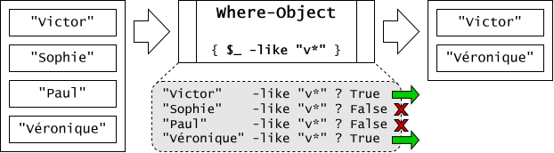

Les commandes PowerShell retournent souvent non pas un objet, mais plusieurs objets dans le pipeline. Par exemple, il est fréquent que la commande `Get-ChildItem` retourne plus d'un objet, car il y a généralement plusieurs fichiers et dossiers dans un dossier.

<ConsoleWindow backgroundColor="#000046" noCopy="true">
```text
PS C:\> Get-ChildItem -Path C:\ -Directory

    Directory: C:\

Mode                 LastWriteTime         Length Name
----                 -------------         ------ ----
d----          2026-07-08    19:17                Android
d----          2025-10-16    17:41                Drivers
d----          2026-04-13    18:00                EspaceLabo
  [...]
```
</ConsoleWindow>

## Compter les objets d'une collection

On peut connaître le nombre d'éléments retournés par une commande à l'aide de la commande `Measure-Object`.

<ConsoleWindow backgroundColor="#000046" noCopy="true">
```text
PS C:\> Get-ChildItem -Path C:\ -Directory | Measure-Object

Count             : 28
Average           :
Sum               :
Maximum           :
Minimum           :
StandardDeviation :
Property          :
```
</ConsoleWindow>


Et comme plusieurs objets mis ensemble constituent une collection d'objets, et que cette collection est également un objet, on peut aussi lire l'attribut `.Length` de cette collection.

<ConsoleWindow backgroundColor="#000046" noCopy="true">
```text
PS C:\> (Get-ChildItem -Path C:\ -Directory).Length
28
```
</ConsoleWindow>


## Accéder à un élément précis

Une collection dans PowerShell est une liste d'objet, qu'on appelle aussi Tableau ou Array, et qui est composé de plusieurs valeurs dans un ordre précis. Chaque élément occupe une position: le premier a la position 0, le deuxième 1, et ainsi de suite. Ces nombre s'appelle un indice (index). On peut obtenir l'élément correspondant en spécifiant l'indice voulu entre crochets.

<ConsoleWindow backgroundColor="#000046" noCopy="true">
```text
PS C:\> (Get-ChildItem -Path C:\ -Directory)[0]

Mode                 LastWriteTime         Length Name
----                 -------------         ------ ----
d----          2026-07-08    19:17                Android

PS C:\> (Get-ChildItem -Path C:\ -Directory)[1]

Mode                 LastWriteTime         Length Name
----                 -------------         ------ ----
d----          2025-10-16    17:41                Drivers
```
</ConsoleWindow>


## Créer un tableau

Un tableau vide est créé avec la formule `@()`. Pour initialiser un nouveau tableau, donc, il suffit d'affecter le tableau vide à une variable. On peut ensuit lui ajouter des éléments, avec un opérateur d'affectation. On ajoute un élément au tableau avec l'opérateur `+=`.

<ConsoleWindow backgroundColor="#000046" noCopy="true">
```text
PS C:\> $tableau = @()
PS C:\> $tableau += 42
PS C:\> $tableau += "Miaou!"
PS C:\> $tableau += (Get-Service -Name "Spooler").Status
PS C:\> $tableau 
42
Miaou!
Running
```
</ConsoleWindow>


Un tableau peut comprendre plusieurs éléments de types différents, mais habituellement, on il est plus logique d'y retrouver des éléments du même type.

On peut affecter directement des valeurs à la création d'un tableau. Dans ce cas, on n'est pas obligé de respecter la syntaxe `@(…)`; elle est implicite.

<ConsoleWindow backgroundColor="#000046" noCopy="true">
```text
PS C:\> $Tableau = "Cric", "Crac", "Croc"
PS C:\> $Tableau
Cric
Crac
Croc
```
</ConsoleWindow>


On peut aussi utiliser un raccourci pour créer rapidement un tableau d'entiers.

<ConsoleWindow backgroundColor="#000046" noCopy="true">
```text
PS C:\> 0..5
0
1
2
3
4
5
```
</ConsoleWindow>


## Sélectionner des éléments

Lorsqu'on a un tableau d'objet qui circule dans le pipeline, on peut vouloir manipuler ce tableau pour en ressortir certains éléments et pas d'autres.

### Sélection des indices

<ConsoleWindow backgroundColor="#000046" noCopy="true">
```text
PS C:\> 0..5 | Select-Object -First 2
0
1

PS C:\> 0..5 | Select-Object -Last 2
4
5

PS C:\> 0..5 | Select-Object -First 2 -Skip 1
1
2

PS C:\> 0..5 | Select-Object -Last 2 -Skip 1
3
4

PS C:\> 0..5 | Select-Object -Index (2..4)
2
3
4
```
</ConsoleWindow>


### Sélection conditionnelle

La commande `Where-Object` (ou ses alias `where` et `?`) permet de filtrer un tableau d'objet pour ne retenir que les éléments qui obéissent à un certain critère. Cette commande est en fait une boucle: elle analyse chacun des objets entrant par le pipeline et lui fait passer un test. Si le test évalue à `$true`, alors l'objet est renvoyé en sortie du pipeline; s'il évalue à `$false`, il est ignoré et ne passe pas à la sortie.



Il y a deux manières d'utiliser cette commande: la méthode simplifiée et la méthode complète.

#### Méthode complète

C'est la manière la plus flexible de filtrer une collection. On spécifie un **script de filtrage** dans son paramètre `FilterScript` (on peut le passer en paramètre positionnel, c'est plus simple). Le script de filtrage doit être inscrit entre **accolades** et comprend le test à faire passer à chaque entrée de la liste. À chaque itération, la variable automatique `$_`, appelée **variable pipeline** représente l'objet en traitement.

<ConsoleWindow backgroundColor="#000046" noCopy="true">
```text
PS C:\> Get-Service | Where-Object { $_.Status -eq "Running" }

Status   Name               DisplayName
------   ----               -----------
Running  agent_ovpnconnect  OpenVPN Agent agent_ovpnconnect
Running  Appinfo            Informations d’application
Running  AppXSvc            AppX Deployment Service (AppXSVC)
Running  AudioEndpointBuil… Générateur de points de terminaison d…
Running  Audiosrv           Audio Windows
  [...]
```
</ConsoleWindow>


#### Méthode simplifiée

Lorsque le filtre est simple (comparaison directe d'une seule propriété avec un opérateur de comparaison), on peut utilise la syntaxe simplifiée et ne pas avoir besoin des accolades et de la variable `$_`. 

:::warning
Cette formule ne fonctionne que pour des cas simples. Elle ne fonctionne pas si on souhaite combiner plusieurs tests avec des opérateurs logiques comme `and` et `or`. Elle ne fonctionne pas non plus avec des types primitifs comme des _strings_ ou des nombres, car ceux-ci n'ont pas de propriétés mais seulement une valeur intrinsèque. Dans ces deux cas, on doit obligatoirement utiliser la forme complète (celle qui inclut la variable `$_`). 

Pour éviter toute confusion, je vous conseille de toujours utiliser la forme complète, qui ne prend que 5 caractères de plus à écrire que la forme simplifiée et qui fonctionne à tous les coups.
:::

<ConsoleWindow backgroundColor="#000046" noCopy="true">
```text
PS C:\> Get-Service | Where-Object Status -EQ "Running"

Status   Name               DisplayName
------   ----               -----------
Running  agent_ovpnconnect  OpenVPN Agent agent_ovpnconnect
Running  Appinfo            Informations d’application
Running  AppXSvc            AppX Deployment Service (AppXSVC)
Running  AudioEndpointBuil… Générateur de points de terminaison d…
Running  Audiosrv           Audio Windows
  [...]

```
</ConsoleWindow>

#### Quelques exemples

Cet exemple retient uniquement les nombres dont la valeur est plus petite que 5.

<ConsoleWindow backgroundColor="#000046" noCopy="true">
```text
PS C:\> 0..10 | Where-Object { $_ -lt 5 }
0
1
2
3
4
```
</ConsoleWindow>

Cet exemple retient uniquement les nombres pairs, c'est-à-dire sont le modulo (opérateur `%`) donne zéro.

<ConsoleWindow backgroundColor="#000046" noCopy="true">
```text
PS C:\> 0..10 | Where-Object { $_ % 2 -eq 0 }
0
2
4
6
8
10
```
</ConsoleWindow>


## Opérations sur un tableau

Voici plusieurs techniques permettant de réaliser des opérations sur des tableaux.

### Opérateur -Contains

Pour **tester** si un tableau contient une valeur spécifique, on peut utiliser l'opérateur `-Contains`.

<ConsoleWindow backgroundColor="#000046" noCopy="true">
```text
PS C:\> $fruits = @('pomme','banane','tomate')
PS C:\> $legumes = @('patate','tomate','carotte')
PS C:\> $fruits -contains 'tomate'
True
PS C:\> $fruits -notcontains 'tomate'
False
```
</ConsoleWindow>

:::info Sensibilité à la classe
Par défaut, sous Windows, les comparaisons de chaînes de caractères sont insensibles à la casse. Les minuscules et les majuscules ont donc la même valeur. Pour effectuer une comparaison qui soit sensible à la casse, les opérateurs à utiliser sont `-ccontains` et `-cnotcontains`.

<ConsoleWindow backgroundColor="#000046" noCopy="true">
```text
PS C:\> $fruits -contains 'Tomate'
True
PS C:\> $fruits -ccontains 'Tomate'
False
```
</ConsoleWindow>
:::

### Concaténation

On peut utiliser l'opérateur de concaténation `+` pour fusionner deux tableaux bout à bout.

<ConsoleWindow backgroundColor="#000046" noCopy="true">
```text
PS C:\> $fruits + $legumes
pomme
banane
tomate
patate
tomate
carotte
```
</ConsoleWindow>


### Union

Pour fusionner deux tableaux mais sans les doublons, vous pouvez utiliser `Select-Object` avec le switch `Unique`.

<ConsoleWindow backgroundColor="#000046" noCopy="true">
```text
PS C:\> $fruits + $legumes | Select-Object -Unique
pomme
banane
tomate
patate
carotte
```
</ConsoleWindow>


### Intersection

Pour obtenir seulement les objets qui sont à la fois dans deux tableaux, on n'a qu'à utiliser une sélection suivie d'un filtre.

<ConsoleWindow backgroundColor="#000046" noCopy="true">
```text
PS C:\> $fruits | Select-Object -Unique | Where-Object { $legumes -contains $_ }
tomate
```
</ConsoleWindow>


### Différence

Pour obtenir les objets d'un tableau qui ne se trouvent pas dans un second tableau, voici comment faire.

<ConsoleWindow backgroundColor="#000046" noCopy="true">
```text
PS C:\> $fruits | Select-Object -Unique | Where-Object { $legumes -notcontains $_ }
pomme
banane
```
</ConsoleWindow>


### Tri

On peut trier une collection à l'aide de la commande `Sort-Object`. La commande trie par défaut en ordre croissant; pour un tri décroissant, on active simplement le switch `Descending`.

<ConsoleWindow backgroundColor="#000046" noCopy="true">
```text
PS C:\> $fruits | Sort-Object
banane
pomme
tomate

PS C:\> $fruits | Sort-Object -Descending
tomate
pomme
banane
```
</ConsoleWindow>


Par défaut, le tri s'effectue sur le nom d'affichage, mais il est possible de spécifier sur quelle propriété devra s'effectuer le tri.

<ConsoleWindow backgroundColor="#000046" noCopy="true">
```text
PS C:\> Get-ChildItem -Path C:\Windows -File | Sort-Object -Descending

    Directory: C:\Windows

Mode                 LastWriteTime         Length Name
----                 -------------         ------ ----
-a---          2024-04-01    04:03         316640 WMSysPr9.prx
-a---          2025-10-17    08:29          45176 WinREQfe.log
-a---          2025-10-17    08:29          19486 WinREDism.log
-a---          2026-04-13    17:54          12288 winhlp32.exe
  [...]

PS C:\> Get-ChildItem -Path C:\Windows -File | Sort-Object -Property Length -Descending

    Directory: C:\Windows

Mode                 LastWriteTime         Length Name
----                 -------------         ------ ----
-a---          2026-01-28    20:44     3160239513 MEMORY.DMP
-a---          2026-08-28    13:16        4080330 PFRO.log
-a---          2026-08-29    11:08        3433437 setupact.log
-a---          2026-08-27    13:21        3389824 explorer.exe
```
</ConsoleWindow>


## Boucle *ForEach-Object*

La commande `ForEach-Object` admet un bloc de script en paramètre, qui sera exécuté pour chaque élément du tableau qui lui est passé en entrée du pipeline. 

L’objet courant est représenté par la variable pipeline `$_` (ou alternativement, `$PSItem`).

<ConsoleWindow backgroundColor="#000046" noCopy="true">
```text
PS C:\> 1..5 | ForEach-Object { Write-Host 'Numéro', $_ }
Numéro 1
Numéro 2
Numéro 3
Numéro 4
Numéro 5
```
</ConsoleWindow>
