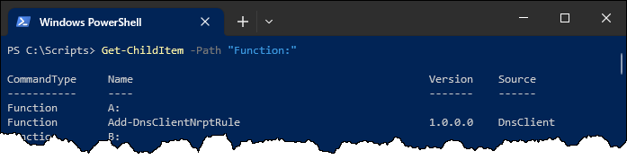

Une fonction PowerShell est un bloc de script qu'on enregistre dans la session en cours. On doit la déclarer en lui donnant un nom, et à l'instar d'un fichier de script, elle se comporte exactement comme un script ou une commande.

Pour déclarer une fonction, on utilise le mot-clé `function` suivi de son nom, et on définit le code de la fonction entre des accolades. Il est recommandé d'indenter le contenu de la fonction.

<Row><Column size="3">
```powershell showLineNumbers="true"
function Get-Zero {
    0
}
```
</Column><Column>
<ConsoleWindow noCopy="true" backgroundColor="#000046">
```powershell
PS C:\Scripts> Get-Zero
0
```
</ConsoleWindow>
</Column></Row>

## Déclaration d'une fonction

Pour pouvoir utiliser une fonction, il faut d'abord la **déclarer** dans la session en cours. Cela peut se faire de plusieurs manières:

### Directement dans la session

C'est la manière la plus simple. Il suffit de taper le code de la fonction directement dans la session PowerShell. 

<ConsoleWindow title="PowerShell" noCopy="true" backgroundColor="#000046">
```powershell
PS C:\Scripts> function Get-Zero {
>>     0
>> }

PS C:\Scripts> Get-Zero
0
```
</ConsoleWindow>

:::tip Tester une fonction dans Visual Studio Code
Si vous êtes dans Visual Studio Code, vous n'avez qu'à sélectionner le code de votre fonction et faire F8 pour la recopier dans le terminal intégré. Vous pourrez ainsi tester votre fonction. N'oubliez pas que si vous modifiez le code de votre fonction, il faut **la redéclarer**.

:::

### En dot-sourçant un script

Si plusieurs fonctions sont déclarées dans un script, vous pouvez importer ces fonctions dans votre session PowerShell en lançant votre script avec l'opérateur **point**. Cet opérateur fera en sorte que tout ce qui est déclaré par votre script (variables, fonctions, etc.) persistera après la fin de celui-ci dans votre session courante.

<Row><Column size="5">
```powershell title="C:\Scripts\FonctionsInutiles.ps1" showLineNumbers="true"
function Get-Zero {
    0
}

function Get-MoinsMille {
    -1000
}
```
</Column><Column>
<ConsoleWindow noCopy="true" backgroundColor="#000046">
```powershell
PS C:\Scripts> . .\FonctionsInutiles

PS C:\Scripts> Get-Zero
0

PS C:\Scripts> Get-MoinsMille
-1000
```
</ConsoleWindow>
</Column></Row>

:::caution
La déclaration d'une fonction **n'a d'effet que dans la session en cours**. Après l'exécution du script ou après fermeture de la fenêtre PowerShell, celle-ci n'existe plus et il faudra la déclarer à nouveau si on veut l'utiliser. 

- Pour que la fonction reste déclarée après la fin d'un script, utilisez le **dot-soucing**.
- Pour que la fonction soit déclarée automatiquement au démarrage dePowerShell, il faut la déclarer dans un **profil**.
:::

:::tip
On peut obtenir la liste de toutes les fonctions qui sont déclarées dans la session PowerShell en cours à l'aide de la commande `Get-ChildItem Function:`.


:::

### Sortie dans le pipeline

Une fonction (tout comme un script, d'ailleurs), dispose en quelque sorte d'un "accumulateur" qui contient tous les objets qui tombent dans le pipeline. À la sortie de la fonction, les objets sortent sous forme de collection.

<Row><Column size="4">
```powershell showLineNumbers="true"
function Get-CrisDAnimaux {
    "Miaou!"
    "Wouf!"
    "Cocorico!"
}
```
</Column><Column>
<ConsoleWindow noCopy="true" backgroundColor="#000046">
```powershell
PS C:\Scripts> Get-CrisDAnimaux | Sort-Object
Cocorico!
Miaou!
Wouf!
```
</ConsoleWindow>
</Column></Row>

### Instruction *Return*

L'instruction `return` permet de sortir un objet sur le pipeline tout en interrompant immédiatement l'exécution de la fonction. 

```powershell showLineNumbers="true"
function Get-Zero {
    return 0
    Write-Host "Ce texte ne sera jamais écrit!"
}
```

:::info
Dans un script, on utilise souvent une fonction lorsque du code se répète souvent, pour éviter de copier-coller le même code à plusieurs endroits dans le script. Une fonction doit obligatoirement être définie avant d'être appelée, mais il est une bonne pratique de déclarer toutes les fonctions au début du script, juste après le bloc de paramètres, mais avant le code principal du script.
:::

### Paramètres d'une fonction

Comme pour les scripts, les fonctions peuvent comprendre des paramètres. On déclare les paramètres dans un bloc `param()` au début de la fonction.


<Row><Column size="4">
```powershell showLineNumbers="true"
function Invoke-Division {
    param (
        [double] $Dividende,
        [double] $Diviseur
    )

    $Dividende / $Diviseur
}
```
</Column><Column>
<ConsoleWindow title="PowerShell" noCopy="true" backgroundColor="#000046">
```powershell
PS C:\Scripts> Invoke-Division 6 2
3

PS C:\Scripts> Invoke-Division -Diviseur 6 -Dividende 2
0,333333333333333
```
</ConsoleWindow>
</Column></Row>


Comme alternative plus légère, on peut aussi déclarer les paramètres directement dans la déclaration de la fonction, entre parenthèses. Cette forme est plus concise et est souvent utilisée pour les fonctions plus courtes.

```powershell showLineNumbers="true"
function Division ([double] $Dividende, [double] $Diviseur) {
    $Dividende / $Diviseur
}
```

