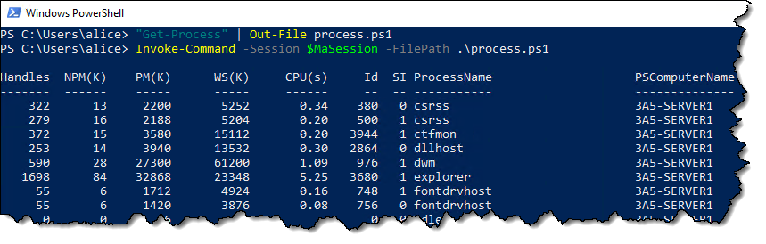
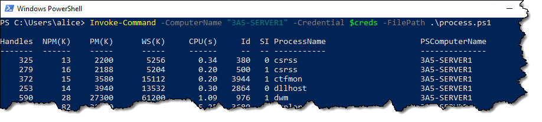
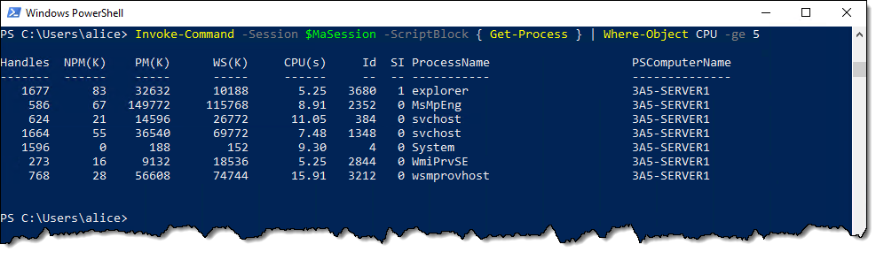
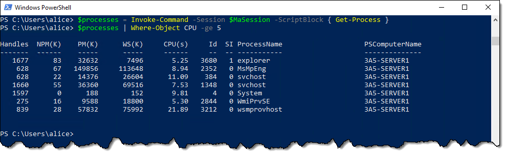
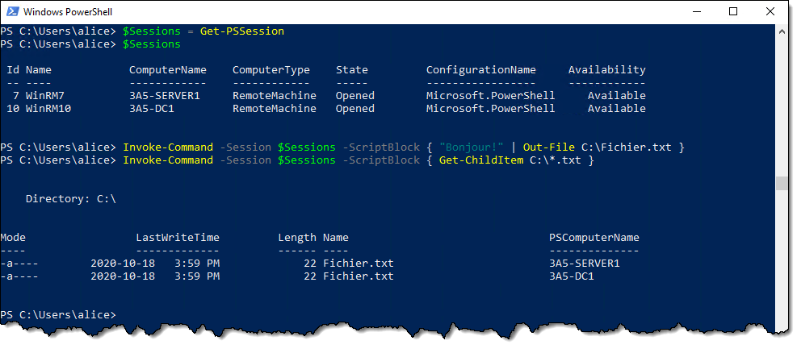
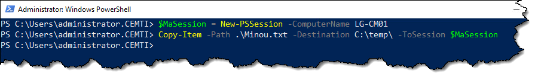
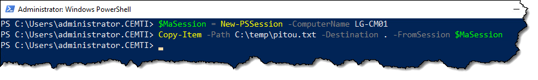

u'on a un plus grand nombre de commandes à lancer sur la machine distante, on peut appeler un script.

Dans cet exemple, on crée un script tout simple composé seulement de la commande `Get-Process`, mais ça pourrait être un script beaucoup plus complexe. Ce script sera lancé dans la session distante.

#### Spécifier les noms de machines au lieu des sessions

On peut aussi créer les sessions automatiquement, en spécifiant les noms de machines plutôt que des sessions, mais si vous avez plusieurs commandes à lancer, il sera plus pratique de réutiliser la même session pour chacune des commandes au lieu de les réinitier à chaque fois.

### PSRemoting et pipeline

Comme c'est une session PowerShell, ce qui sort de la commande distante, c'est un objet. Et cet objet sort sur le pipeline local du client. Autrement dit, quand la commande est lancée à distance, ce qu'elle laisse dans le pipeline revient à l'appelant, et nous pouvons manipuler cet objet à notre guise.

On peut aussi affecter cet objet dans une variable.

### Plusieurs sessions en même temps

On peut lancer une commande sur plusieurs sessions d'un coup. 

### Copie de fichiers à travers une session

Il est possible de copier un fichier à travers une session PSRemoting à l'aide de la commande `Copy-Item`.

#### De la machine locale vers la machine distante

Si on spécifie le paramètre `-ToSession`, on envoie le fichier vers la machine cible. Le paramètre -Path représente donc le chemin sur la machine locale, et le paramètre -Destination représente le chemin sur la machine distante.

#### De la machine distante vers la machine locale

À l'inverse, si on spécifie le paramètre `-FromSession`, alors on tire le fichier de l'ordinateur distant vers l'ordinateur local. Le paramètre `-Path` représente alors le chemin sur la machine distante, et le paramètre `-Destination`, celui sur la machine locale.

