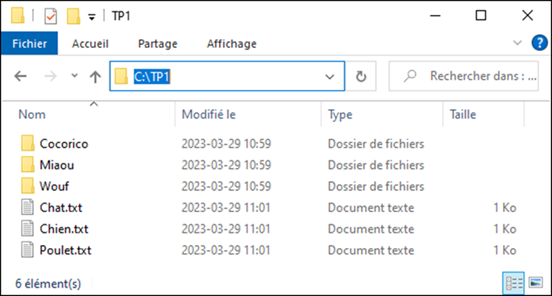

Ce travail pratique compte pour 10% de la note finale. Il peut être fait en équipes de 2. Vous devez le remettre sur GitHub avant la date limite, autrement une pénalité de **10% par jour de retard** peut s’appliquer (jusqu’à un maximum de 5 jours calendrier; ensuite le travail sera noté 0).

La remise doit se faire au plus tard **vendredi 19 septembre avant 8h00 du matin** sur GitHub.

Pour faire votre TP, vous devez d'abord suivre le lien que votre professeur vous fournira. Il vous créera un dépôt sur GitHub avec les fichiers de départ. Ces fichiers sont:
- tp1.ps1
- data.csv

Vous pouvez utiliser la méthode de votre choix pour travailler avec GitHub. La méthode préférée du prof est celle intégrée à VS Code, mais s'il y en a une que vous préférez, utilisez-la. Les clients Git installés dans les labos sont GitHub Desktop et Fork. Vous pouvez aussi utiliser l'éditeur de fichiers directement dans l'interface de GitHub sur le Web.

Le travail est noté sur 40 et compte pour 10% de la note du cours.

À chacune des questions, répondez en inscrivant la ligne de commande dans le fichier PS1.

Utilisez seulement des commandes PowerShell (pas de commandes externes). Vous pouvez utiliser les alias et les paramètres positionnels si vous le souhaitez, sauf si le contraire est spécifié dans l'énoncé de la question.

:::caution
Ce TP est fait pour être testé sur un poste de travail d'un laboratoire informatique au collège. Si vous réalisez ce TP à la maison, il se peut que vos commandes ne se comportent pas correctement. Assurez-vous de tester ce TP au CÉGEP avant la remise.
:::

## Question 1 *(15 points)*

La commande `Get-NetAdapter` permet d’obtenir la liste des adapteurs réseau (Ethernet, Wi-Fi, etc.) installés dans l’ordinateur. Il existe aussi d’autres commandes `Get-NetAdapter*` pour obtenir de l’information plus spécifique sur les adapteurs réseau. 

**a)** Affichez **les adapteurs réseau** installés sur votre machine. *(1 point)*

**b)** Obtenez la liste **des propriétés et des méthodes** des objets produits par `Get-NetAdapter`. *(2 point)*

**c)** Obtenez **le nombre** d’adapteurs réseau installés sur votre machine. *(2 points)*

**d)** Générez un rapport, sous forme de **tableau**, indiquant le **nom de l’adapteur**, son **état** (connecté ou non), son **adresse MAC** et sa **vitesse**. *(2 points)*

**e)** Obtenez la liste des adapteurs qui sont **connectés seulement**. *(2 points)*

**f)** Obtenez la liste des adapteurs **physiques** (qui ne sont pas virtuels). *(2 points)*

**g)** Obtenez la liste des adapteurs dont l’adresse MAC commence par 00-50 ou 00-15. *(2 points)*

**h)** Trouvez la commande permettant d’obtenir des **statistiques d’utilisation** de chaque cartes réseau (nombre d’octets reçus et envoyés). *(2 points)*


## Question 2 *(5 points)*

Vous voulez créer la structure d’arborescence suivante dans le système de fichiers, en PowerShell. Pour chaque question, donnez les commandes PowerShell nécessaire pour accomplir le résultat demandé. **N’utilisez pas d’alias.** 



**a)** Donnez toutes les commandes PowerShell qui permettent de créer cette structure (y compris le répertoire parent `C:\TP1`). Le fichier `Chat.txt` doit contenir le texte « Miaou », le fichier `Chien.txt` doit contenir le texte « Wouf » et le fichier `Poulet.txt` doit contenir le texte « Cocorico ». *(3 points)*

**b)** Donnez toutes les commandes PowerShell pour déplacer le fichier `Chat.txt` dans le répertoire `Miaou`, le fichier `Chien.txt` dans le répertoire `Wouf` et le fichier `Poulet.txt` dans le répertoire `Cocorico`. *(2 points)*

> *2 points bonis si vous le faites en une seule ligne, uniquement en chaînant des commandes avec le |.*


## Question 3 *(15 points)*

Dans le dépôt, il y a un fichier `data.csv`. Ouvrez le fichier dans le bloc-notes (*notepad*) pour voir ce qu'il contient (il ne fonctionnera pas dans Excel). Puis, répondez aux questions suivantes.

**a)** Chargez le contenu du fichier CSV et affectez-le à une variable. *(1 point)*

**b)** Obtenez la liste des animaux qui sont nés après le 31 décembre 2019, triés par ordre décroissant de date, affiché en format tableau. *(2 points)*

**c)** Obtenez la liste des poissons mangeurs de foin et affichez-la en format tableau. *(2 points)*

**d)** Obtenez la liste des lapins qui pèsent plus de 30 kg et affichez-la en format tableau. *(2 points)*

**e)** Obtenez le nom (seulement le nom) du plus vieux hamster. *(2 points)*

**f)** En utilisant la commande `Group-Object`, comptez le nombre d'animaux de chaque espèce. *(2 points)*

**g)** Dressez un tableau contenant seulement le nom et l'espèce de tous les animaux qui sont nés en novembre ou en décembre. *(2 points)*

**h)** Écrivez la liste des animaux à la console à l'aide de `Write-Host`, en n'indiquant que leur nom, leur espèce et leur poids converti en livres (1 kg = 2,2 lbs). *(2 points)*

> La sortie devrait ressembler à ceci:
> 
> ```
> Luna: Oiseau de 73,238 lbs
> Sadie: Chien de 59,334 lbs
> Luna: Chat de 18,788 lbs
> Luna: Cochon d'Inde de 49,654 lbs
> ```


## Question 4 *(5 points)*

:::caution
Cette question doit être répondue dans les ordinateurs des laboratoires. Elle pourrait ne pas fonctionner sur un autre ordinateur.
:::

Dans votre ordinateur, il y a plusieurs interfaces réseau qui ont une adresse IP. Pourtant, une seule est connectée à Internet. *(5 points)*

Élaborez une ligne de commande PowerShell qui obtient **l'adresse IPv4** de l'interface **qui sert à naviguer sur Internet**.

> La sortie devrait ressembler à ceci (un exemple sur un poste au D0622):
> ```
> PS C:\> (votre ligne de commande)
> 10.10.49.98
> ```


:::tip Indices
- Intéressez-vous aux commandes `Get-NetIPAddress` et `Get-NetRoute`.
- Utilisez les parenthèses pour insérer dans un argument le résultat d'un sous-pipeline.
- Rappelez-vous vos notions de réseau sur les tables de routage! Comment pouvez-vous identifier la carte réseau qui sort sur Internet?
:::


