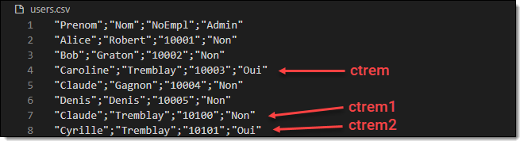

Ce TP est à faire individuellement. Il compte pour **15%** de la note du cours et **30%** du seuil des travaux en laboratoire. La remise doit obligatoirement se faire sur le dépôt GitHub fourni par le professeur.


## Préparation

Avant de commencer le TP, vous devez mettre en place les éléments suivants:

- Montez votre [environnement de laboratoire](/exercices/montage-lab) (si ce n'est pas déjà fait).
- Installez le logiciel [Git](https://git-scm.com/downloads/win) sur votre machine de développement.
- Si ce n'est pas déjà fait, installez [Visual Studio Code **System Installer x64**](https://code.visualstudio.com/Download) ainsi que l'extension [PowerShell](https://marketplace.visualstudio.com/items?itemName=ms-vscode.PowerShell) (et tout autre extension souhaitée) sur votre machine de développement.
- Authentifiez-vous sur la machine de développement (PCDEV) avec le compte d'**admin du domaine** (`NOMDEVOTREDOMAINE\Administrateur`).
- Suivez le lien que votre prof vous a donné pour initialisez votre dépôt sur GitHub.
- Clonez ce dépôt localement sur votre **VM de développement** avec le client Git de votre choix (GitHub Desktop, Fork, ou directement dans VS Code).
- Créez l'unité d'organisation (OU) "**Utilisateurs**" à la racine de votre domaine. (Vous pouvez le faire graphiquement ou avec la commande `New-ADOrganizationalUnit`). 
 
<Highlight color="yellow">Il n'est pas demandé que votre script soit responsable de créer l'arborescence dans AD.</Highlight>


## Mandat

Vous devez développer un script PowerShell qui vise à créer des utilisateurs **du domaine** en lot. Les utilisateurs à créer sont définis dans un fichier CSV.

### Le fichier d’entrée

Le fichier CSV est construit dans le format suivant, séparé par des **points-virgules** :

```csv
Prenom;Nom;NoEmpl;Admin
Alice;Robert;10001;Non
Bob;Graton;10002;Non
Caroline;Tremblay;10003;Oui
Claude;Gagnon;10004;Non
Claude;Tremblay;10100;Non
Denis;Denis;10005;Non
Patricia;Larose;10006;Non
Germaine;Ladouceur;10007;Non
Cyrille;Tremblay;10101;Oui
Henri;Pavoine;10008;Non
Paul;Meilleur;10009;Oui
Pierre;Laroche;10010;Non
Agnès;Toutant;10011;Non
```
 
On y trouve le prénom, le nom, le poste et le numéro d’employé de chaque utilisateur à créer, ainsi qu’un champ identifiant si l’utilisateur doit être administrateur du système (oui ou non).

:::info
Notez que je n’exige pas que votre script fonctionne pour les utilisateurs dont le nom de famille est inférieur à 4 lettres. Dans mon fichier de correction, tous les utilisateurs ont un nom de famille d’au moins 4 lettres.
:::

### Comptes utilisateurs

Votre script devra créer un compte sur Active Directory pour chaque utilisateur spécifié dans ce fichier. Voici les consignes :

- Les utilisateurs doivent obligatoirement être créés dans l'unité d'organisation **Utilisateurs** située à la racine du domaine. Utilisez la propriété **DefaultNamingContext** de l'objet retourné par `Get-ADRootDSE` pour déterminer dynamiquement le suffixe du nom distinctif.

- Le **nom d’utilisateur** doit être la première lettre du prénom et les 4 premières du nom de famille, en **lettres minuscules**. (Dans ce travail, il n’y aura pas de noms de famille de moins de 4 caractères). Les attributs **Name**, **sAMAccountName** et **UserPrincipalName** doivent tous trois porter ce nom.

- Le **prénom** et le **nom** de l'utilisateur correspond au fichier d'entrée.

- Le **nom complet** de l’utilisateur est son prénom suivi de son nom.

- La **description** de l’utilisateur est son numéro d'employé..

- Le **mot de passe** doit être les 2 premières lettres du nom de famille en **majuscules**, les 2 premières lettres du prénom en **minuscules**, suivi du numéro d’employé.

- L'utilisateur **doit changer son mot de passe** à la prochaine ouverture de session.

- Si l’utilisateur doit être **admin**, il doit être ajouté au groupe des **Admins du domaine**.

Si on devait créer les utilisateurs manuellement, voici à quoi ils ressembleraient dans l'interface graphique:


### Gestion des conflits de nom

Lors du traitement des utilisateurs, il se peut qu’il y ait plusieurs utilisateurs qui portent des noms semblables, qui auraient des noms d’utilisateurs identiques. Programmez la logique nécessaire dans votre script pour que si un nom d’utilisateur doit être identique à un existant, il doit être suivi d’un 1, puis d'un 2, puis d’un 3, et ainsi de suite, comme illustré ci-dessous.




### Lancement du script

Le script doit **exiger** un paramètre `-Path` **obligatoire** dans lequel on spécifie le chemin du fichier CSV à charger. Le script doit alors créer les utilisateurs selon les paramètres indiqués dans le fichier. 

Pour chaque utilisateur créé, le script doit retourner sur le pipeline un objet de type `PSCustomObject` avec une propriété "Compte" contenant le nom d'utilisateur, une propriété "MotDePasse" contenant le mot de passe en clair (pour faciliter la correction) et une propriété booléenne "Admin" qui indique si oui ou non le compte a été ajouté aux admins du domaine.


```
# highlight-next-line
PS C:\EspaceLabo> .\Import-ADUsers -Path ".\users.csv"

Compte MotDePasse Admin
------ ---------- -----
arobe  ROal10001  False
bgrat  GRbo10002  False
ctrem  TRca10003  True
cgagn  GAcl10004  False
ctrem1 TRcl10100  False
...    ...        ...
```

Le script ne doit **pas montrer de message d'erreur**. Il ne doit pas non plus envoyer **d'autres objets sur le pipeline** que ceux mentionnés ci-dessus.

Le paramètre `-Path` doit aussi pouvoir accepter une valeur à **l'entrée du pipeline**.

Les comptes ainsi créés devraient être visibles dans la console Utilisateurs et ordinateurs Active Directory.


 
### Validation du paramètre

Le script doit planter si le chemin spécifié en paramètre est invalide. Pour ce faire, vous devez utiliser les **fonctionnalités de validation des paramètres** de PowerShell.


 
### Journalisation

Le script doit aussi garder une trace de toutes les actions qu’il entreprend dans le fichier **Import-ADUsers.log** :

| Événement                                      | Niveau         |
| :--------------------------------------------- | :------------- |
| Début du script                                | ✅ `Info`      |
| Traitement d’un utilisateur                    | ✅ `Info`      |
| Création de l’utilisateur                      | ✅ `Info`      |
| Ajout au groupe d'administration si nécessaire | ✅ `Info`      |
| Conflit de nom                                 | ⚠️ `Warning` |
| Fin du script                                  | ✅ `Info`      |
| Toute autre erreur                             | ❌ `Error`     |

Chaque ligne doit être horodatée (timestamp) dans le [**format ISO 8601**](https://learn.microsoft.com/en-us/dotnet/standard/base-types/standard-date-and-time-format-strings#the-round-trip-o-o-format-specifier). Cette fonctionnalité doit être réalisée au moyen d’une **fonction**, et cette dernière doit avoir un **maximum d’autonomie**. Par ailleurs, le fichier doit être situé sous **C:\\Users\\*nomdutilisateur*\\AppData\\Local\\Temp\\Import-ADUsers\\** (celui-ci doit être créé automatiquement s’il n’existe pas). Vous devez utiliser au maximum les **variables d’environnement** offertes par Windows. 

**La logique de création automatique de répertoire devrait se trouver dans la fonction de journalisation.**

Voici un exemple de fichier Log:

```
2025-10-02T15:29:35.9082949-04:00    Info       === Début du script ===
2025-10-02T15:29:36.7544988-04:00    Info       Traitement de l'utilisateur Alice Robert (10001)
2025-10-02T15:29:37.4283110-04:00    Info       Création de l'utilisateur arobe complétée
2025-10-02T15:29:38.0432167-04:00    Info       Traitement de l'utilisateur Bob Graton (10002)
2025-10-02T15:29:38.6659834-04:00    Info       Création de l'utilisateur arobe complétée
2025-10-02T15:29:39.2540231-04:00    Info       Traitement de l'utilisateur Caroline Tremblay (10003)
2025-10-02T15:29:39.9575342-04:00    Info       Création de l'utilisateur ctrem complétée
2025-10-02T15:29:40.4906254-04:00    Info       L'utilisateur ctrem a été défini comme admin du domaine
2025-10-02T15:29:41.0217125-04:00    Info       Traitement de l'utilisateur Claude Gagnon (10004)
2025-10-02T15:29:41.5828334-04:00    Info       Création de l'utilisateur cgagn complétée
2025-10-02T15:29:42.1425306-04:00    Info       Traitement de l'utilisateur Claude Tremblay (10100)
2025-10-02T15:29:42.6185013-04:00    Warning    Utilisateur ctrem existant
2025-10-02T15:29:43.1193062-04:00    Info       Création de l'utilisateur ctrem1 complétée
2025-10-02T15:29:43.6235816-04:00    Info       Traitement de l'utilisateur Denis Denis (10005)
2025-10-02T15:29:44.3556437-04:00    Info       Création de l'utilisateur ddeni complétée
2025-10-02T15:29:45.0895326-04:00    Info       Traitement de l'utilisateur Cyrille Tremblay (10101)
2025-10-02T15:29:45.7064314-04:00    Warning    Utilisateur ctrem existant
2025-10-02T15:29:46.2957725-04:00    Warning    Utilisateur ctrem1 existant
2025-10-02T15:29:46.8274362-04:00    Info       Création de l'utilisateur ctrem2 complétée
2025-10-02T15:29:47.5320266-04:00    Info       L'utilisateur ctrem2 a été défini comme admin du domaine
2025-10-02T15:29:48.0913995-04:00    Info       === Fin du script
```


## Consignes de remise

Vous devez remettre ce travail sur GitHub. Vous êtes libres d’utiliser le client Git de votre choix (VS Code, GitKraken, GitHub Desktop, SourceTree, git cli, etc.) ou même simplement télécharger vos fichiers par l'interface Web.


## Conseils

Voici quelques conseils qui pourraient vous aider à mener à bien ce travail :
- Commencez votre codage à partir du squelette fourni dans ce dépôt
- Avant de commencer à coder, décrivez les étapes en pseudo-code pour déterminer la logique générale du script. Vous pourrez ensuite "traduire" ce pseudo-code en PowerShell, étape par étape.
- Ne *hard-codez* jamais le chemin vers le fichier CSV, utilisez plutôt les paramètres
- N'utilisez pas les variables globales dans votre fonction, utilisez plutôt les paramètres pour lui passer un intrant
- Commencez par utiliser le fichier `users_simple.csv` car celui-ci est plus simple et ne contient pas de doublons.
- Utilisez la variable `$PSScriptRoot` pour faire référence au répertoire où est situé le script
- Utilisez une machine virtuelle pour tester votre script. Vous pouvez installer VS Code sur votre VM pour développer votre script.
- Sur votre VM, démarrez une session en tant qu'administrateur du domaine. Le script ne fonctionnera pas avec un compte local.
- Utilisez le paramètre `-WhatIf` pour tester votre script sans qu’une action réelle ne soit posée.
- **Utilisez le débogueur!!!**
- Faites-vous un petit script de nettoyage pour effacer les utilisateurs créés en trop.
- Utilisez GitHub à votre avantage. Dès que vous avez réussi quelque chose dans votre script, faites un commit et un push dans GitHub. Vous pourrez ainsi profiter de l’historique.
- Testez des parties de votre script au lieu de lancer le script au complet à chaque fois. N’hésitez pas à tester les commandes toutes seules, définir des variables manuellement pour tester, etc.
- Faites des commits/push régulièrement. C'est une bonne méthode de travail et ça vous évite de perdre du code.
- **N'attendez pas à la dernière minute pour commencer votre travail!!!**


## Critères d’évaluation

| Critère                         | Pondération |
| :------------------------------ | ----------: |
| Fonctionnement général          |         /15 |
| Traitement des paramètres       |         /10 |
| Création des utilisateurs       |         /25 |
| Gestion des conflits de noms    |         /10 |
| Journalisation                  |         /15 |
| Style et lisibilité             |         /10 |
| Respect des consignes de remise |          /5 |
| Qualité du français             |         /10 |
| **Total**                       |    **/100** |


Voici plus en détails les éléments qui seront évalués:

#### Fonctionnement général *(15 points)*
- Le script fonctionne du premier coup et aucune erreur n'est affichée pendant l'exécution
- Les objets demandés sont envoyés sur le pipeline (sous forme de `PSCustomObject`)
- La structure des objets en sortie correspond à l'énoncé
- Aucun autre objet n'est envoyé sur le pipeline à la sortie du script
- Aucun chemin n'est *hard-codé*

#### Traitement des paramètres *(10 points)*
- Le paramètre est déclaré correctement dans un bloc Param()
- Le paramètre a le bon nom et le bon type
- Le paramètre est obligatoire
- Le paramètre peut être passé à l'entrée du pipeline
- Le paramètre valide correctement l'existence du fichier
- Le fichier CSV accédé par le script est celui qui a été passé en paramètre

#### Création des utilisateurs *(25 points)*
- Le fichier CSV est correctement importé en utilisant la commande appropriée
- Les comptes utilisateurs sont créés au bon endroit dans l'arborescence
- La racine du domaine est constituée dynamiquement à l'aide de `Get-ADRootDSE`
- Le nom d'utilisateur est correctement construit
- Le mot de passe est correctement construit
- Les deux noms d'utilisateurs (sAMAccountName et UserPrincipalName) sont affectés
- Les comptes créés ont leurs attributs Nom, Prénom et Description correctement affectés 
- L'option "L'utilisateur devra changer le mot de passe" est activée
- Les utilisateurs sont ajoutés au groupe des Admins du domaine lorsque spécifié dans le fichier
  
#### Gestion des conflits de noms *(10 points)*
- Les conflits de noms sont traités tel que demandé pour un nombre illimité d'utilisateurs

#### Journalisation *(15 points)*
- Le script effectue sa journalisation à l'aide d'une fonction
- La fonction de log permet de spécifier le message et le niveau en paramètre
- La fonction de log est responsable de créer le fichier et le répertoire
- La fonction de log est responsable de construire le timestamp
- Le *timestamp* est construit avec le format demandé
- Les entrée du log sont écrites dans le format demandé
- Toutes les entrées demandées sont présentes dans le fichier log
- Le fichier log est stocké à l'emplacement demandé du profil de l'utilisateur
- Le chemin est construit à l'aide d'une variable d'environnement

#### Style et lisibilité *(10 points)*
- Pas d'alias ni de paramètres positionnels dans l'utilisation des commandes
- Choix judicieux des noms de variables et de fonctions
- Utilisation judicieuse des commentaires
- Propreté générale du code (indentation, etc.)

#### Respect des consignes *(5 points)*
- Remise sur le dépôt GitHub fourni par le professeur
- Le squelette de script fourni a été utilisé
- Le nom du script correspond à ce qui est demandé
- Les commentaires demandés en en-tête ont été correctement remplis (nom et prénom)

#### Français *(10 points)*
- Qualité du français dans les commentaires
- Qualité du français dans les *commits* sur GitHub

