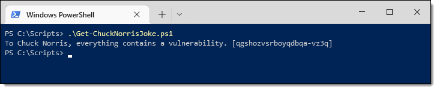
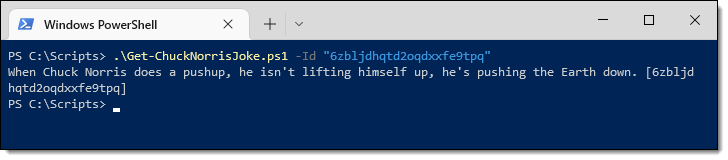
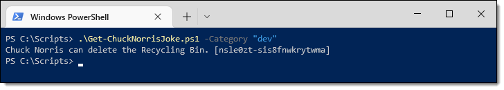
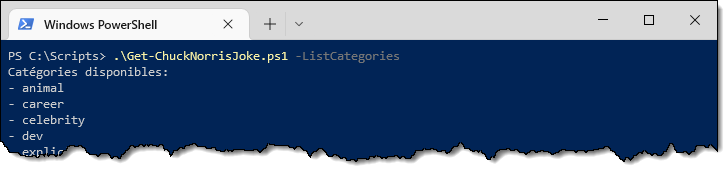
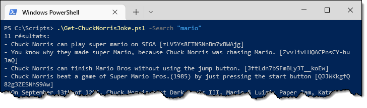
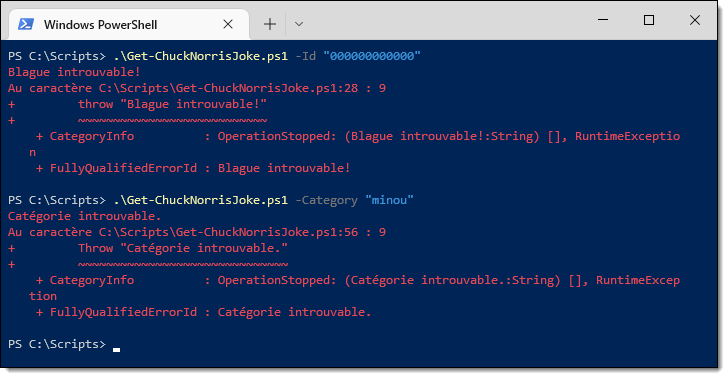
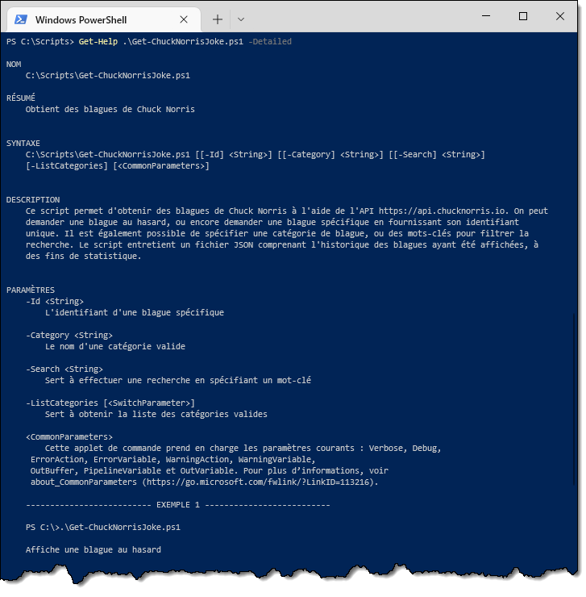
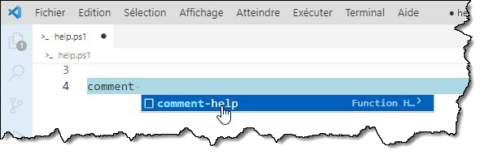

Ce TP légendaire est à réaliser en équipe de deux. Il compte pour **10%** de la note du cours. 

:::info Consignes de remise
La date limite pour la remise du travail est le **mardi 11 novembre 2025 à 23h59**.

Vous devez remettre le script sur le dépôt GitHub fourni par le professeur avec un commit appelé **"Remise finale"**. Votre plan de test doit quant à lui être sauvegardé sur [Azure DevOps](https://infdevops.cegepmontpetit.ca/A25-3T5-Automatisation/) sous le nom de **"TP3"**.

Vous devez tout d'abord activer le dépôt du TP, puis former vos équipes sur GitHub de la même manière que pour le TP1. Ensuite, le prof vous créera un projet d'équipe sur Azure DevOps.
:::

## Mandat

Votre patron vous demande de développer un script PowerShell permettant de raconter de bonnes vieilles blagues de Chuck Norris afin d'augmenter la profitabilité de l'entreprise.

Vous devez utiliser l’API **ChuckNorris.io** (https://api.chucknorris.io/) pour générer les blagues. Cette API prend des requêtes GET et retourne du contenu JSON.

Voici les fonctionnalités à implémenter (elles doivent se comporter **exactement** comme dans la capture d’écran) :

### Blague aléatoire

Lorsque le script est exécuté sans aucun paramètre, il affiche une blague au hasard. Le numéro d’identification unique de cette blague doit être écrit entre crochets à la fin de la blague, pour référence.

 
### Blague spécifique

Lorsqu’on passe le numéro d’identification d’une blague dans le paramètre `-Id`, la blague correspondante est affichée.

### Filtrage par catégorie

Si on spécifie le paramètre `-Category` suivi du nom d’une catégorie valide, une blague au hasard est affichée, mais seulement dans cette catégorie. Cela limite les choix possibles.

### Liste des catégories

On peut obtenir la liste des catégories valides en spécifiant le switch `-ListCategories`.

 
### Recherche de blague

On peut rechercher un mot-clé spécifique dans la base de données de blagues. En passant ce mot-clé par le paramètre `-Search`, on obtient la liste des blagues contenant ce mot-clé. On doit aussi voir le nombre de résultats.

### Gestion des erreurs

Si on spécifie un identifiant ou une catégorie erronée, on doit recevoir une erreur claire dans le *error stream*.

 
### Rubrique d’aide

On doit pouvoir afficher une rubrique d’aide complète avec la commande `Get-Help`.

:::tip
Pour la rubrique d'aide, il faut utiliser un bloc de type *comment-based help*. Vous en saurez plus en consultant [cette documentation](https://learn.microsoft.com/fr-ca/powershell/module/microsoft.powershell.core/about/about_comment_based_help).

L'extension PowerShell de Visual Studio Code permet la création d'un squelette de rubrique d'aide. Vous n'avez qu'à écrire "comment..." au début de votre script et sélectionner le *snippet* `comment-help`.

:::

### Plan de test

Vous devez élaborer un plan de test d'intégration. Pour cette partie du TP, vous devez utiliser [Azure DevOps](https://infdevops.cegepmontpetit.ca/A25-3T5-Automatisation/). Si vous êtes à la maison, vous devez utiliser le VPN pour vous connecter.

Vous devez décrire, **dans la perspective d'un utilisateur-testeur**, le scénario qui permettra de valider que le script répond à toutes les attentes. Autrement dit, vous guidez un utilisateur-testeur à travers **toutes les étapes** de l'exécution du script en décrivant les **actions** qu'il devra effectuer ainsi que le **résultat attendu** qu'il devra constater.

Pour ce travail, par souci de simplicité, vous devrez rédiger un seul cas de test qui devra faire le tour de tous les scénarios d'utilisation (y compris ceux qui doivent donner une erreur).

La première étape du cas doit être les **préconditions**.

:::danger
Un test d'intégration **n'est pas** un test unitaire. On ne teste pas le code. Si des lignes de code de votre script se retrouvent dans le plan de test, c'est 0 automatique sur cette partie du travail.
:::

## Critères d'évaluation

Le travail sera noté sur 20 points. Voici la grille qui servira à la correction:

| Critère                       |   Pondération |
| :---------------------------- | ------------: |
| Blague aléatoire              |       1 point |
| Blague spécifique             |      2 points |
| Filtrage par catégorie        |      2 points |
| Liste des catégories          |      2 points |
| Recherche de blagues          |      3 points |
| Gestion des erreurs           |       1 point |
| Rubrique d'aide               |       1 point |
| Conception et style du script |      2 points |
| Plan de test                  |      3 points |
| Respect des consignes         |       1 point |
| Qualité du français           |      2 points |
| **Total**                     | **20 points** |

Voici plus en détails les éléments qui seront évalués:

#### Blague aléatoire *(1 point)*
- Le script peut être appelé sans paramètre.
- Une blague aléatoire s'affiche à la console.
- Le numéro d'identification de la blague s'affiche entre crochets à la fin de la ligne.
- L'appel d'API est juste.
- Aucun message d'erreur ou objet résiduel n'est affiché.

#### Blague spécifique *(2 points)*
- Le script peut être appelé avec le paramètre `-Id` suivi de l'identifiant.
- La blague correspondant à l'identifiant spécifié en paramètre.
- Le numéro d'identification de la blague s'affiche entre crochets à la fin de la ligne.
- L'appel d'API est juste.
- Aucun message d'erreur ou objet résiduel n'est affiché.

#### Filtrage par catégorie *(2 points)*
- Le script peut être appelé avec le paramètre `-Category` suivi du nom d'une catégorie valide.
- Une blague aléatoire tirée de cette catégorie est affichée.
- Le numéro d'identification de la blague s'affiche entre crochets à la fin de la ligne.
- L'appel d'API est juste.
- Aucun message d'erreur ou objet résiduel n'est affiché.

#### Liste des catégories *(2 points)*
- Le script peut être appelé avec le paramètre `-ListCategories` (sans argument).
- La liste des catégories est affichée.
- L'affichage est fidèle à l'énoncé (titre de la liste, puis les éléments avec des puces).
- L'appel d'API est juste.
- Aucun message d'erreur ou objet résiduel n'est affiché.

#### Recherche de blagues *(3 points)*
- Le script peut être appelé avec le paramètre `-Search` avec une chaîne à rechercher.
- La liste des blagues correspondantes est affichée.
- L'affichage est fidèle à l'énoncé (nombre de résultats, puis les blagues avec des puces).
- Le numéro d'identification de la blague s'affiche entre crochets à la fin de chaque blague.
- L'appel d'API est juste.
- Aucun message d'erreur ou objet résiduel n'est affiché.

#### Gestion des erreurs *(1 point)*
- Lorsque le paramètre `-Id` est utilisé avec un identifiant invalide, le script lance une erreur "Blague introuvable".
- Lorsque le paramètre `-Category` est utilisé avec une catégorie invalide, le script lance une erreur "Catégorie introuvable".
- Les erreurs doivent être de vraies erreurs et non simplement du texte écrit en rouge.
- La décision du script de lancer une erreur doit découler d'un appel d'API

#### Rubrique d'aide *(1 point)*
- Le bloc d'aide est déclaré selon les normes de PowerShell;
- Tous les paramètres y sont documentés;
- Les exemples choisis sont pertinents.

#### Conception et style *(2 points)*
- La logique générale du script est correcte
- Les paramètres sont définis correctement
- Aucune utilisation de paramètres positionnels et d'alias dans le code
- Pas de chemins hard-codés
- Pas de code redondant, d'affectations inutiles, d'évaluations tautologiques, etc.
- Choix approprié des noms des variables, des fonctions, etc.
- Style et lisibilité, qualité des commentaires, indentation et espacement du code.

#### Plan de test (*3 points*)
- Le plan de test a été fait de la manière vue en classe.
- Tous les cas doivent être testés (y compris les erreurs).
- Les actions sont dans la perspective du testeur et non celle du programmeur.
- La description des préconditions, des actions ainsi que du résultat attendu est précise et claire.
- On ne teste pas le code!

#### Respect des consignes (*1 point*)
- La remise du script a été faite sur GitHub tel que demandé.
- La remise du plan de test a été faite sur AzureDevOps tel que demandé.
- Le script part du repo de départ fourni par le professeur.
- Le script a pour nom `Get-ChuckNorrisJoke.ps1`.
- Vous avez bien inscrit vos noms et matricules dans le bloc de commentaires au début.

#### Qualité du français (*2 points*)
- Qualité du français dans le code (commentaires, noms de variables...).
- Qualité du français dans les commits sur GitHub.
- Qualité du français dans le plan de test.
- L'évaluation se fera, au possible, conformément à la grille en annexe du plan de cours.
---

**BON TRAVAIL!**

